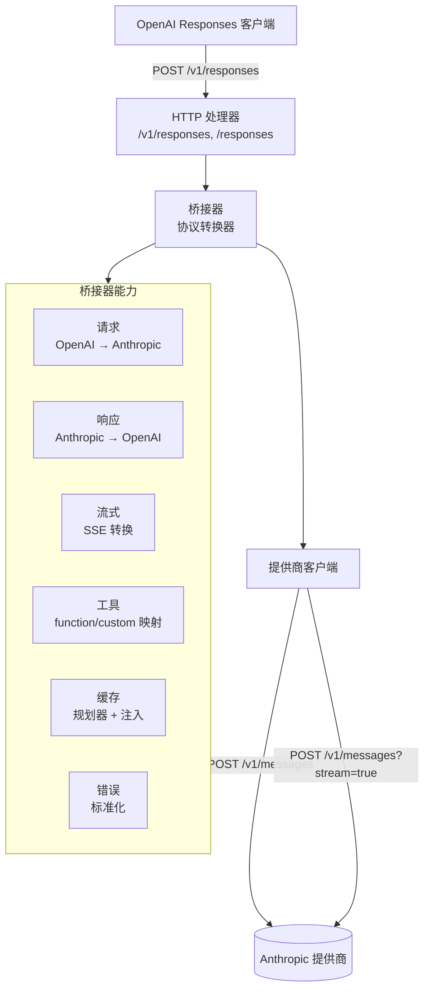

# Anthropic Messages 到 OpenAI Responses 桥接器

一个协议转换层，对外暴露兼容 OpenAI Responses 的 API（`POST /v1/responses`），同时将请求转发给任意兼容 Anthropic Messages 的上游提供商。桥接器负责请求/响应映射、工具调用转换、提示缓存、流式传输和错误标准化。

支持的客户端包括 [Codex CLI](https://github.com/openai/codex)、自定义工具链，以及任何基于 OpenAI Responses API 构建、需要路由到 Anthropic Messages 提供商的应用程序。

## 架构



包结构（Go 模块 `moonbridge`）：

```
internal/openai        OpenAI Responses DTO 和 SSE 事件类型
internal/anthropic     Anthropic Messages DTO 和 HTTP 客户端
internal/bridge        协议转换、错误映射、流式状态机
internal/cache         缓存创建规划器、断点注入、用量标准化
internal/config        YAML 配置加载和校验
internal/server        /v1/responses 和 /responses 的 HTTP 处理器
internal/proxy         透明代理模式（CaptureResponse、CaptureAnthropic）
internal/trace         请求/响应转储到本地文件系统
internal/app           应用组装和生命周期管理
internal/e2e           真实提供商端到端测试
```

## 配置

基于 YAML，详见 [config.example.yml](/home/zhiyi/Projects/misc/MoonBridge/config.example.yml)。默认从 `config.yml` 加载配置文件，可通过 `MOONBRIDGE_CONFIG` 环境变量覆盖。敏感凭证和本地覆盖项放入被 `.gitignore` 忽略的 `config.yml`；示例文件始终纳入版本控制。

### 模式

| 模式 | 用途 |
| --- | --- |
| `Transform` | 协议转换：OpenAI Responses 进，Anthropic Messages 出。主要使用场景。 |
| `CaptureResponse` | 透明代理，捕获真实的 OpenAI Responses API 流量而不做转换。用于协议对齐测试。 |
| `CaptureAnthropic` | 透明代理，捕获真实的 Anthropic Messages API 流量而不做转换。用于理解原生客户端行为。 |

## 请求映射

| OpenAI Responses 字段 | Anthropic Messages 字段 | 处理方式 |
| --- | --- | --- |
| `model` | `model` | 通过配置进行别名映射；模型名称不做硬编码。 |
| `instructions` | `system` | 最高优先级的系统指令；developer 角色输入前置。 |
| `input`（字符串） | `messages[0].content` | 单条用户文本消息。 |
| `input[].role=user` | `messages[].role=user` | 文本块直接透传；图片在提供商支持时转换。 |
| `input[].role=assistant` | `messages[].role=assistant` | 历史记录中的文本内容和 tool_use 块。 |
| `function_call_output` / 工具输出 | `role=user` + `tool_result` | `call_id` → `tool_use_id`。 |
| `max_output_tokens` | `max_tokens` | 缺失时从配置注入默认值。 |
| `temperature` / `top_p` | 同名参数 | 直接透传；不支持的参数返回错误。 |
| `stop` | `stop_sequences` | 标准化为字符串数组。 |
| `stream` | `stream` | 直接透传；切换 SSE 转换器。 |
| `tool_choice:"auto"` | `tool_choice:auto` 或省略 | 优先使用原生 auto。 |
| `tool_choice:"none"` | `tool_choice:none` 或省略工具 | 如果提供商不支持 none，则省略工具。 |
| `tool_choice:"required"` | `tool_choice:any` | 必须调用任意工具。 |
| `tool_choice:{function:{name}}` | `tool_choice:{type:"tool",name}` | 指定工具。 |

### 输入标准化

1. `input` 被解析为字符串或条目数组。
2. `system`/`developer` 角色条目被提取到 Anthropic 的顶层 `system` 字段。
3. `user`/`assistant` 消息顺序被保留，不做跨轮次合并。
4. 多模态内容（`input_text`、`input_image`）按提供商能力画像处理。
5. `previous_response_id` 需要 `store=true` 和活跃的本地存储；否则返回 400。

### 自定义工具与 Codex 兼容性

在桥接 Codex CLI 流量时，桥接器处理无法当作普通 JSON 函数对待的 OpenAI `custom` 语法工具：

| 指令类型 | Anthropic 结构 | 反向映射 |
| --- | --- | --- |
| `apply_patch` | 拆成 `apply_patch_add_file` / `apply_patch_delete_file` / `apply_patch_update_file` / `apply_patch_replace_file` / `apply_patch_batch` 一组结构化工具 | 全部回映射为 Codex 的 `custom_tool_call.name="apply_patch"`，并重建 `*** Begin Patch` / `*** End Patch` 原始语法。 |
| `exec`（代码模式） | `{source: string}` | `source` 字段作为原始自定义工具输入返回。 |
| 其他 custom / freeform | `{input: string}` | 从 `input` 字段提取原始输入字符串。 |

`namespace` 工具在 Anthropic 侧被展平为 `namespace__tool` 命名。响应回 Codex 时，function 工具会按本轮请求映射拆回 `namespace` + 子工具 `name`，避免 MCP 调用被 Codex 当成未知扁平函数；`custom_tool_call` 条目随 `response.custom_tool_call_input.delta` 流式事件发出。

### Web Search 桥接


OpenAI `web_search`/`web_search_preview` 工具会在 Provider 支持时转换为 Anthropic `web_search_20250305` 服务端工具。`provider.web_search.support:auto` 会在 Transform 启动时用默认模型做一次流式轻量探测；只有探测证明可用才注入，否则本轮进程保守禁用搜索工具注入。也可以用 `enabled` 强制注入，或用 `disabled` 完全关闭。在响应侧，`server_tool_use:web_search` 被映射回 Codex `web_search_call` 输出条目。空搜索结果和前导消息（`Search results for query:`）会被过滤，避免污染对话历史。
### Injected Web Search

`injected` 模式：桥接器不依赖 Provider 的服务端搜索工具，改为向模型注入 `tavily_search`（function-type 工具）和可选的 `firecrawl_fetch` 两个函数工具。模型调用这些工具时，websearch orchestrator 拦截调用、通过 Tavily / Firecrawl API 执行搜索、将结果回传给模型继续推理，最后的响应中搜索过程对 Codex 完全透明。需要配置 `tavily_api_key`；`firecrawl_api_key` 可选（不配则不注入 `firecrawl_fetch`）。

### 历史记录合并

在转换 Codex 对话历史中的连续工具调用时，桥接器：

1. 将连续的 `function_call` / `local_shell_call` 条目合并为单条 Anthropic assistant `tool_use` 消息。
2. 将连续的工具输出合并为单条 user `tool_result` 消息。
3. 这防止上游提供商因不匹配的 `tool_calls`/`tool_messages` 而拒绝请求。

## 提示缓存

提示缓存是本桥接器的一等关切，因为 OpenAI 的缓存是自动的，而 Anthropic 需要显式的 `cache_control` 标记。简单的逐字段翻译会悄无声息地破坏缓存。

### 策略模式

| 模式 | 行为 | 使用场景 |
| --- | --- | --- |
| `off` | 不注入 `cache_control`。 | 严格禁用缓存，或提供商不支持。 |
| `automatic` | 在请求顶层添加 `cache_control:{type:"ephemeral"}`。 | 多轮对话，缓存断点随历史移动。 |
| `explicit` | 在最后一个稳定的工具、系统块或消息内容块上放置 `cache_control`。 | 大型系统提示、工具定义、长文档、示例集。 |
| `hybrid` | 同时在顶层和块级别放置 `cache_control`。 | 同时缓存工具/系统和不断增长的对话历史。 |

配置中有两个独立控制项：

- `automatic_prompt_cache`：控制顶层请求 `cache_control`。
- `explicit_cache_breakpoints`：控制工具/系统/消息上的块级断点。

当两者都开启且 `mode: automatic` 时，规划器实际上会生成 hybrid 计划。

### 缓存创建计划

Anthropic 没有独立的"创建缓存" API。缓存是在带有 `cache_control` 标记的常规 `messages.create` 请求中创建的。`CacheCreationPlanner` 在每次转发请求前运行。

**规划器输入：**

- `model`（OpenAI 别名和解析后的提供商模型）
- `prompt_cache_key`（桥接器本地路由提示，从不发送给提供商）
- `prompt_cache_retention` → 映射为 TTL（`in_memory` → `5m`，`24h` → `1h`，需降级显式同意）
- `tools`、`system`、`messages` 的哈希值（规范 JSON → SHA-256）
- 用于阈值检查的预估 token 数
- 本地缓存注册表状态（warm / warming / expired / not_cacheable）

**规划器输出：**

```go
type CacheCreationPlan struct {
    Mode        string            // off, automatic, explicit, hybrid
    TTL         string            // 5m, 1h
    LocalKey    string            // 所有稳定指纹组件的 SHA-256
    Breakpoints []CacheBreakpoint // 作用域：tools, system, messages
    WarmPolicy  string            // none, leader, background
    Reason      string
}
```

**决策流程：**

1. 提供商能力检查 → 如果提示缓存被禁用则跳过。
2. 稳定性检查 → 从缓存前缀中排除时间戳、请求 ID、随机值、最新用户消息。
3. Token 阈值检查 → 如果预估 token 低于 `min_cache_tokens` 则跳过。
4. 价值检查 → 如果 `estimated_tokens * expected_reuse` 低于 `minimum_value_score` 则跳过。
5. 注册表检查 → 如果已经是 warm，重新注入相同断点以获得读取命中。
6. 断点选择 → 优先 `tools` → `system` → `messages` 稳定前缀，最多 4 个断点。

**断点放置：**

| 前缀模式 | 断点位置 | 说明 |
| --- | --- | --- |
| 大型工具集 + 短系统提示 | 最后一个工具定义 | 跨会话稳定 |
| 长系统提示 | 最后一个系统文本块 | `system` 必须是块数组 |
| 长文档作为首条用户消息 | 首条用户消息中最后一个文本/图片块 | 断点后是后续问题 |
| 多轮会话 | 最后一条稳定历史消息 | 最新用户问题被排除 |
| 工具调用后延续 | 最后一条稳定 `tool_result` 之后 | 工具结果每次调用不同 |

**注入算法：**

1. 构建不带缓存字段的 Anthropic 请求。
2. 对 `tools`、`system`、`messages` 进行规范 JSON 编码并计算哈希。
3. 运行 `CacheCreationPlanner` 获取 `CacheCreationPlan`。
4. 对于 `automatic`/`hybrid`：设置 `request.CacheControl = {type:"ephemeral", ttl:"1h"}`。
5. 对于 `explicit`/`hybrid`：在选定的工具/系统/消息块上设置 `block.CacheControl`。
6. 重新编码请求并记录 `request_fingerprint` 用于命中率分析。

### 用量标准化

缓存激活时，Anthropic 的 `usage.input_tokens` 仅代表最后一个缓存断点之后的新输入。桥接器将其标准化为 OpenAI 的预期格式：

```text
openai.usage.input_tokens =
  anthropic.usage.cache_read_input_tokens
  + anthropic.usage.cache_creation_input_tokens
  + anthropic.usage.input_tokens

openai.usage.input_tokens_details.cached_tokens =
  anthropic.usage.cache_read_input_tokens
```

提供商级别的明细（`cache_creation_input_tokens`、`cache_creation.ephemeral_*`）保留在 `response.metadata.provider_usage` 中供成本分析。注意 `cached_tokens` 始终序列化，即使为零，以避免 Codex 解析错误。

### 并发与预热

- **Singleflight**：对于给定的 `local_cache_key`，只有一个"leader"请求写入缓存；跟随者要么等待第一个上游响应事件，要么直接转发。
- **后台预热**：可选；发送一个最小请求（例如"只回复 OK"）并带上缓存标记来预预热。这仍然会消耗 token。
- **注册表**：内存中，记录 `local_cache_key`、断点哈希、TTL、时间戳和近期用量信号。不存储提示文本。

### 结果判定

缓存效果由 Anthropic 用量信号决定，而不是由请求中是否存在 `cache_control` 决定：

| 用量信号 | 缓存注册表更新 |
| --- | --- |
| `cache_creation_input_tokens > 0` | `warm` — 写入成功，更新 expires_at |
| `cache_read_input_tokens > 0` | `warm` — 读取命中，累积命中率 |
| 两者都为 0，且 `input_tokens` 较低 | `not_cacheable` — 可能低于阈值 |
| 两者都为 0，且 token 充足 | `missed` — 怀疑前缀不稳定 |
| 提供商缓存参数错误 | `failed` — 不带缓存字段重试 |

## 工具调用映射

| OpenAI | Anthropic | 说明 |
| --- | --- | --- |
| `{type:"function", name, description, parameters}` | `{name, description, input_schema}` | `parameters` 必须是 JSON Schema 对象。 |
| `{type:"local_shell"}` | `{name:"local_shell", ...}` | Codex `local_shell_call` ↔ `tool_use`。包含 command、working_directory、timeout_ms、env。 |
| `{type:"custom"}` 带 grammar | 按 grammar 类型划分的结构化 JSON schema | `apply_patch` → add/delete/update/replace/batch 工具集合；`exec` → source 字符串。 |
| `namespace` | 展平为 `namespace__tool` | 子 function/custom 带命名空间前缀展开；function 响应回 Codex 时拆回 `namespace` + 子工具 `name`。 |
| `web_search_preview` | `{type:"web_search_20250305"}` 或跳过 | 最大使用次数和是否注入来自 `provider.web_search` 配置/探测。 |
| `file_search`、`computer_use_preview`、`image_generation` | 跳过 | 在工具声明中静默忽略。 |

### 响应侧

Anthropic `tool_use` → OpenAI 响应条目：

| Anthropic | OpenAI |
| --- | --- |
| `text` 块 | `output[].type="message"`，带 `output_text` 内容部分 |
| `tool_use`（function） | `output[].type="function_call"`，带 `call_id`、`name`、`arguments`、`status`；若来自 namespace 工具则额外带 `namespace` |
| `tool_use`（local_shell） | `output[].type="local_shell_call"`，带结构化 `action` |
| `tool_use`（custom） | `output[].type="custom_tool_call"`，带 grammar 重建的 `input` |
| `server_tool_use:web_search` | `output[].type="web_search_call"`，带 `action`（空时过滤） |

### 下一轮

OpenAI `function_call_output` 条目 → Anthropic `role=user` 消息中的 `tool_result` 块。

## 流式传输

Anthropic SSE 事件通过状态机转换为 OpenAI Responses SSE，状态机跟踪内容索引、输出索引、条目 ID 和序列号。

| Anthropic 事件 | OpenAI Responses SSE 事件 |
| --- | --- |
| `message_start` | `response.created` → `response.in_progress` |
| `content_block_start`（text） | `response.output_item.added`（message）→ `response.content_part.added`（output_text） |
| `content_block_delta`（text_delta） | `response.output_text.delta` |
| `content_block_stop`（text） | `response.output_text.done` → `response.content_part.done` → `response.output_item.done` |
| `content_block_start`（tool_use） | `response.output_item.added`（function_call / local_shell_call / custom_tool_call） |
| `content_block_delta`（input_json_delta） | `response.function_call_arguments.delta` / `response.custom_tool_call_input.delta`（自定义工具）/ web search JSON 内部累积 |
| `content_block_stop`（tool_use） | `response.function_call_arguments.done` → `response.output_item.done` |
| `message_delta` | 更新聚合响应用量和状态 |
| `message_stop` | `response.completed` 或 `response.incomplete` |
| `error` | `response.failed` |
| `ping` | 忽略或作为注释帧转发 |

SSE 不变量：

- 每个事件携带单调递增的 `sequence_number`。
- 文本增量事件包含 `item_id`、`output_index` 和 `content_index`。
- 最终用量直到 `message_stop` 才发出。
- Web search 和自定义工具的 `input_json_delta` 流式事件在内部累积，在 `content_block_stop` 时发出。
- 提供商连接失败产生 `response.failed` 并关闭 SSE 连接。

## 停止原因映射

| Anthropic | OpenAI 状态 | 不完整详情 |
| --- | --- | --- |
| `end_turn` | `completed` | — |
| `tool_use` | `completed` | — |
| `stop_sequence` | `completed` | — |
| `max_tokens` | `incomplete` | `{reason:"max_output_tokens"}` |
| `model_context_window` | `incomplete` | `{reason:"max_input_tokens"}` |
| `refusal` | `completed` | —（发出 `refusal` 内容部分） |
| `pause_turn` | `incomplete` | `{reason:"provider_pause"}` |

## 错误映射

| 场景 | HTTP 状态码 | OpenAI 错误码 |
| --- | --- | --- |
| 认证失败 | 401 | `invalid_api_key` |
| 权限 / 模型不可用 | 403 | `model_not_found` / `permission_denied` |
| 不支持的字段 | 400 | `unsupported_parameter` |
| 无效的 JSON schema | 400 | `invalid_request_error` |
| 上下文超限 | 400 / 413 | `context_length_exceeded` |
| 提供商限流 | 429 | `rate_limit_exceeded` |
| 提供商 5xx | 502 | `provider_error` |
| 提供商超时 | 504 | `provider_timeout` |

错误响应使用标准 OpenAI 格式：

```json
{
  "error": {
    "message": "Unsupported tool type: web_search_preview",
    "type": "invalid_request_error",
    "param": "tools[0].type",
    "code": "unsupported_parameter"
  }
}
```

## 运维说明

### 追踪记录

当 `trace_requests: true` 时，桥接器将请求/响应对转储到本地文件系统用于调试。追踪按模式和会话组织：

- `Transform`：`trace/Transform/{session_id}/Response/{n}.json` + `Anthropic/{n}.json`
- `Capture`：`trace/Capture/{Response|Anthropic}/{session_id}/{n}.json`

API 密钥已脱敏。追踪路径在 `.gitignore` 中。

### 代理模式

两种捕获模式运行透明 HTTP 代理，将请求转发给上游提供商而不做协议转换：

- **CaptureResponse**：记录原生 OpenAI Responses API 流量。认证由代理配置覆盖，但 `User-Agent` 透传。
- **CaptureAnthropic**：记录原生 Anthropic Messages API 流量。用于捕获 Claude Code 的实际请求模式，以指导 Transform 模式的默认值。

### 能力画像

提供商能力在 `config.yml` 中声明：

```yaml
cache:
  mode: "explicit"           # off / automatic / explicit / hybrid
  ttl: "5m"                  # 5m / 1h
  prompt_caching: true
  automatic_prompt_cache: false
  explicit_cache_breakpoints: true
  allow_retention_downgrade: false
  max_breakpoints: 4
```

所有不支持但被请求的能力都会产生显式错误 —— 不做静默降级。

### 安全

- 提供商 API 密钥从不暴露给客户端；客户端和上游密钥分开配置。
- 日志对 `Authorization` 头、工具参数中的类键字段、以及图片/文件 base64 内容进行脱敏。
- 请求/响应追踪包含追踪 ID 但不包含完整提示（除非审计模式开启）。
- `.gitignore` 覆盖 `config.yml`、`config.yaml`、`helloagents/`、`.codex`、`.claude`、`AGENTS.md`、`CLAUDE.md`、`trace/` 和 `FakeHome/`。

## 实现状态

- OpenAI Responses 和 Anthropic Messages 的 DTO 定义（请求、响应、流式事件、错误）
- 非流式文本请求/响应转换
- 带 SSE 状态机的流式转换（文本、tool_use 增量、生命周期事件）
- Function 工具 schema 映射和工具调用桥接
- Codex 专属工具支持：`local_shell`、`custom`（apply_patch 工具集合、exec）、`namespace`、`web_search`
- Codex 对话历史合并（连续工具调用 → 合并的 Anthropic 轮次）
- 带 automatic/explicit/hybrid 断点策略的提示缓存规划器
- `cache_control` 注入和用量标准化
- 缓存注册表（内存中），带状态跟踪和并发 leader/follower 模式
- 错误映射（从提供商错误生成 OpenAI 风格错误）
- 追踪记录（按模式、按会话、按请求编号）
- 透明代理模式（CaptureResponse、CaptureAnthropic）
- 配置 schema 校验
- 真实提供商端到端测试

### 已知缺口

- 不支持多数 OpenAI 内置工具（`file_search`、`computer_use`、`code_interpreter`）；`web_search` 会按 Provider 能力桥接到 Anthropic 服务端工具
- 不支持文件 ID 解析或后台响应
- 不支持 `previous_response_id` / `response.store` 持久化
- 没有真实 token 计数器；缓存阈值使用粗略估算（`len(json)/4`）
- 缓存注册表仅在内存中；重启后不保留
- 没有后台缓存预热工作线程
- 默认不支持 24h 保留；需要 `allow_retention_downgrade` 显式同意

## 参考

- [Anthropic Messages API](https://docs.anthropic.com/en/api/messages)
- [Anthropic Tool Use](https://docs.anthropic.com/en/docs/agents-and-tools/tool-use/overview)
- [Anthropic Streaming](https://docs.anthropic.com/en/docs/build-with-claude/streaming)
- [Anthropic Prompt Caching](https://docs.anthropic.com/en/docs/build-with-claude/prompt-caching)
- [OpenAI Responses API](https://platform.openai.com/docs/api-reference/responses/create)
- [OpenAI Responses Object](https://platform.openai.com/docs/api-reference/responses/object)
- [OpenAI Streaming Responses](https://platform.openai.com/docs/guides/streaming-responses)
- [OpenAI Prompt Caching](https://platform.openai.com/docs/guides/prompt-caching)
- [Codex CLI](https://github.com/openai/codex)
