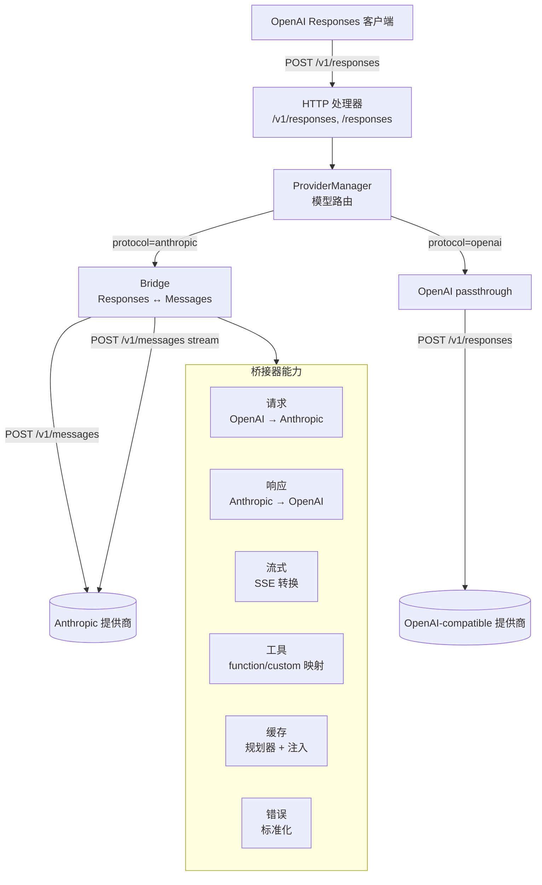

# Anthropic Messages 到 OpenAI Responses 桥接器

一个 OpenAI Responses 兼容转发层，对外暴露 `POST /v1/responses`。Transform 模式下，Moon Bridge 按模型别名路由请求：Anthropic 协议 Provider 会经过 OpenAI Responses ↔ Anthropic Messages 转换；OpenAI 协议 Provider 会保留 Responses 格式直通上游。桥接器负责请求/响应映射、工具调用转换、提示缓存、流式传输、usage/billing 统计和错误标准化。

支持的客户端包括 [Codex CLI](https://github.com/openai/codex)、自定义工具链，以及任何基于 OpenAI Responses API 构建、需要路由到不同上游 Provider 的应用程序。

## 架构



包结构（Go 模块 `moonbridge`）：

```
internal/openai        OpenAI Responses DTO 和 SSE 事件类型
internal/anthropic     Anthropic Messages DTO 和 HTTP 客户端
internal/bridge        协议转换、错误映射、流式状态机
internal/cache         缓存创建规划器、断点注入、用量标准化
internal/config        YAML 配置加载和校验
internal/provider      多 Provider 路由、protocol 判断和连接池
internal/server        /v1/responses 和 /responses 的 HTTP 处理器
internal/session       每请求状态隔离
internal/stats         session usage / billing 统计
internal/proxy         透明代理模式（CaptureResponse、CaptureAnthropic）
internal/trace         请求/响应转储到本地文件系统
internal/extensions    Provider 扩展（DeepSeek V4 thinking、web search injected）
internal/app           应用组装和生命周期管理
internal/e2e           真实提供商端到端测试
```

## 配置


Provider 在 `models` 中声明可用的上游模型及元信息，`routes` 把客户端别名映射到 `"provider/upstream_model"`：

```yaml
provider:
  providers:
    deepseek:
      base_url: "https://api.deepseek.com"
      api_key: "replace-with-deepseek-api-key"
      version: "2023-06-01"
      deepseek_v4: true
      models:
        deepseek-v4-pro:
          context_window: 1000000
          max_output_tokens: 384000
          pricing:
            input_price: 2
            output_price: 8
    openai:
      base_url: "https://api.openai.com"
      api_key: "replace-with-openai-api-key"
      protocol: "openai"
      models:
        gpt-image-1.5: {}

  routes:
    moonbridge: "deepseek/deepseek-v4-pro"
    gpt-image: "openai/gpt-image-1.5"
```

`protocol` 默认为 `anthropic`。设置为 `openai` 时，Transform 不进入 Anthropic 转换层，只改写请求中的 `model` 并代理到上游 Responses 端点。

### 模式

| 模式 | 用途 |
| --- | --- |
| `Transform` | 协议转换：OpenAI Responses 进，Anthropic Messages 出。主要使用场景。 |
| `CaptureResponse` | 透明代理，捕获真实的 OpenAI Responses API 流量而不做转换。用于协议对齐测试。 |
| `CaptureAnthropic` | 透明代理，捕获真实的 Anthropic Messages API 流量而不做转换。用于理解原生客户端行为。 |

## 请求映射

| OpenAI Responses 字段 | Anthropic Messages 字段 | 处理方式 |
| --- | --- | --- |
| `model` | `model` | 通过 `provider.providers.<key>.models` 进行别名映射和 Provider 路由；模型名称不做硬编码。 |
| `instructions` | `system` | 最高优先级的系统指令；developer 角色输入前置。 |
| `input`（字符串） | `messages[0].content` | 单条用户文本消息。 |
| `input[].role=user` | `messages[].role=user` | 当前提取文本块（`input_text` / `text` / `output_text`）。 |
| `input[].role=assistant` | `messages[].role=assistant` | 历史记录中的文本内容和 tool_use 块。 |
| `function_call_output` / 工具输出 | `role=user` + `tool_result` | `call_id` → `tool_use_id`。 |
| `max_output_tokens` | `max_tokens` | 缺失时从配置注入默认值。 |
| `temperature` / `top_p` | 同名参数 | Anthropic 路径默认透传；启用 DeepSeek V4 扩展时会移除这两个字段以适配 Provider。 |
| `stop` | `stop_sequences` | 标准化为字符串数组。 |
| `stream` | `stream` | 直接透传；切换 SSE 转换器。 |
| `tool_choice:"auto"` | `tool_choice:auto` 或省略 | 优先使用原生 auto。 |
| `tool_choice:"none"` | `tool_choice:none` 或省略工具 | 如果提供商不支持 none，则省略工具。 |
| `tool_choice:"required"` | `tool_choice:any` | 必须调用任意工具。 |
| `tool_choice:{function:{name}}` | `tool_choice:{type:"tool",name}` | 指定工具。 |

### 输入标准化

1. `input` 被解析为字符串或条目数组。
2. `system`/`developer` 角色条目被提取到 Anthropic 的顶层 `system` 字段。
3. `user`/`assistant` 消息顺序被保留；连续工具调用和连续工具输出会在后续步骤中归并成 Anthropic 合法轮次。
4. 当前只提取文本内容块（`input_text`、`text`、`output_text`）；图片、文件 ID 和后台 response store 尚未实现。
5. `previous_response_id` / `store` 会被解析，但当前没有本地 response store，不会自动补历史。

### 自定义工具与 Codex 兼容性

在桥接 Codex CLI 流量时，桥接器处理无法当作普通 JSON 函数对待的 OpenAI `custom` 语法工具：

| 指令类型 | Anthropic 结构 | 反向映射 |
| --- | --- | --- |
| `apply_patch` | 拆成 `apply_patch_add_file` / `apply_patch_delete_file` / `apply_patch_update_file` / `apply_patch_replace_file` / `apply_patch_batch` 一组结构化工具 | 全部回映射为 Codex 的 `custom_tool_call.name="apply_patch"`，并重建 `*** Begin Patch` / `*** End Patch` 原始语法。`replace_file` 和 `update_file + content` 会转成 `Delete File` + `Add File` 的整文件替换，避免生成空 Update hunk。 |
| `exec`（代码模式） | `{source: string}` | `source` 字段作为原始自定义工具输入返回。 |
| 其他 custom / freeform | `{input: string}` | 从 `input` 字段提取原始输入字符串。 |

Anthropic 侧 schema proxy 工具的 description 只描述结构化 JSON 输入，不拼入 Codex 原始 `FREEFORM` / grammar 文本，避免 Provider 被互相矛盾的说明影响而不调用工具。

`namespace` 工具在 Anthropic 侧被展平为 `namespace__tool` 命名。响应回 Codex 时，function 工具会按本轮请求映射拆回 `namespace` + 子工具 `name`，避免 MCP 调用被 Codex 当成未知扁平函数；`custom_tool_call` 条目随 `response.custom_tool_call_input.delta` 流式事件发出。

### Web Search 桥接

Web search 支持按 Provider 独立配置和判断。每个 Provider 可在 `provider.providers.<key>.web_search.support` 中单独设置，未配置时回退全局 `provider.web_search.support`。

| 模式 | 行为 |
| --- | --- |
| `auto` | Transform 启动时按 Provider 独立探测：使用该 Provider 的第一个上游模型发送轻量 `web_search_20250305` 工具声明探测，只有探测证明可用才注入。非 Anthropic 协议 Provider 自动禁用。 |
| `enabled` | 强制注入 Anthropic `web_search_20250305` 服务端工具。 |
| `disabled` | 完全关闭搜索工具注入。 |
| `injected` | 不依赖 Provider 的服务端搜索工具，改为向模型注入 `tavily_search`（function-type 工具）和可选的 `firecrawl_fetch`。模型调用这些工具时，websearch orchestrator 拦截调用、通过 Tavily / Firecrawl API 执行搜索、将结果回传给模型继续推理。需要配置 `tavily_api_key`；`firecrawl_api_key` 可选。 |

在响应侧，`server_tool_use:web_search` 被映射回 Codex `web_search_call` 输出条目。空搜索 action 和前导消息（`Search results for query:`）会被过滤，避免污染对话历史。

`Bridge.ToAnthropic()` 接收 per-request `RequestOptions`（含 `WebSearchMode`、`WebSearchMaxUses`、`FirecrawlAPIKey`），由 server 层按 provider key 构建，确保每个请求按其路由到的 Provider 决定 web search 行为。

### 历史记录合并

在转换 Codex 对话历史中的连续工具调用时，桥接器：

1. 将连续的 `function_call` / `local_shell_call` 条目合并为单条 Anthropic assistant `tool_use` 消息。
2. 将连续的工具输出合并为单条 user `tool_result` 消息。
3. 这防止上游提供商因不匹配的 `tool_calls`/`tool_messages` 而拒绝请求。

### DeepSeek V4 扩展

当当前模型路由到的 Provider 配置 `deepseek_v4: true` 时，桥接器启用 DeepSeek thinking 状态扩展：

- 处理 `reasoning_content` 剥离和 `reasoning_effort` → thinking 映射。
- 流式 thinking delta 收集和 signature-only thinking block 保留。
- thinking 状态按 Session 隔离，并发请求互不干扰。
- 请求时移除 `temperature` / `top_p` 以适配 DeepSeek Provider。

## 提示缓存

提示缓存是本桥接器的一等关切，因为 OpenAI 的缓存是自动的，而 Anthropic 需要显式的 `cache_control` 标记。简单的逐字段翻译会悄无声息地破坏缓存。

### 策略模式

| 模式 | 行为 | 使用场景 |
| --- | --- | --- |
| `off` | 不注入 `cache_control`。 | 严格禁用缓存，或提供商不支持。 |
| `automatic` | 在请求顶层添加 `cache_control:{type:"ephemeral"}`。 | 多轮对话，缓存断点随历史移动。 |
| `explicit` | 在工具、system 和若干个稳定消息前缀上放置 `cache_control`。 | 大型系统提示、工具定义、长文档、长会话工具循环。 |
| `hybrid` | 同时在顶层和块级别放置 `cache_control`。 | 同时缓存工具/系统和不断增长的对话历史。 |

配置中有两个独立控制项：

- `automatic_prompt_cache`：控制顶层请求 `cache_control`。
- `explicit_cache_breakpoints`：控制工具/系统/消息上的块级断点。

当两者都开启且 `mode: automatic` 时，规划器实际上会生成 hybrid 计划。

### 缓存创建计划

Anthropic 没有独立的"创建缓存" API。缓存是在带有 `cache_control` 标记的常规 `messages.create` 请求中创建的。`CacheCreationPlanner` 在每次转发请求前运行。

**规划器输入：**

- `model`（OpenAI 别名和解析后的提供商模型）
- `prompt_cache_key`（桥接器本地路由提示，从不发送给提供商）
- `prompt_cache_retention` → 映射为 TTL（`in_memory` → `5m`，`24h` → `1h`，需降级显式同意）
- `tools`、`system`、`messages` 的哈希值（规范 JSON → SHA-256）
- 用于阈值检查的预估 token 数
- 本地缓存注册表状态（warm / warming / expired / not_cacheable）

**规划器输出：**

```go
type CacheCreationPlan struct {
    Mode        string            // off, automatic, explicit, hybrid
    TTL         string            // 5m, 1h
    LocalKey    string            // 所有稳定指纹组件的 SHA-256
    Breakpoints []CacheBreakpoint // 作用域：tools, system, messages
    WarmPolicy  string            // 当前为 none
    Reason      string
}
```

**断点放置：**

| Scope | 断点位置 | 说明 |
| --- | --- | --- |
| `tools` | 最后一个工具定义 | 当本轮请求存在工具时加入 |
| `system` | 最后一个 system 块 | 当本轮请求存在 system / instructions 时加入 |
| `messages` | 若干个消息前缀的最后一个稳定 content block | 总是包含最新前缀；若还有断点预算，会在更早的 user/tool_result 边界均匀补点，降低长会话反复整段重建的 cache write |

### 用量标准化

缓存激活时，Anthropic 的 `usage.input_tokens` 仅代表最后一个缓存断点之后的新输入。桥接器将其标准化为 OpenAI 的预期格式：

```text
openai.usage.input_tokens =
  anthropic.usage.cache_read_input_tokens
  + anthropic.usage.cache_creation_input_tokens
  + anthropic.usage.input_tokens

openai.usage.input_tokens_details.cached_tokens =
  anthropic.usage.cache_read_input_tokens
```

提供商级别的明细保留在 `response.metadata.provider_usage` 中供成本分析。`cached_tokens` 始终序列化，即使为零，以避免 Codex 解析错误。

### 注册表与预热

- **注册表**：内存中，记录 `local_cache_key`、状态、过期时间和近期用量信号。不存储提示文本。
- **预热**：当前没有后台预热 worker，也没有跨请求 singleflight；缓存创建依赖正常请求携带 `cache_control` 后由 Provider 返回 `cache_creation_input_tokens`。

## 工具调用映射

| OpenAI | Anthropic | 说明 |
| --- | --- | --- |
| `{type:"function", name, description, parameters}` | `{name, description, input_schema}` | `parameters` 必须是 JSON Schema 对象。 |
| `{type:"local_shell"}` | `{name:"local_shell", ...}` | Codex `local_shell_call` ↔ `tool_use`。包含 command、working_directory、timeout_ms、env。 |
| `{type:"custom"}` 带 grammar | 按 grammar 类型划分的结构化 JSON schema | `apply_patch` → add/delete/update/replace/batch 工具集合；`exec` → source 字符串。 |
| `namespace` | 展平为 `namespace__tool` | 子 function/custom 带命名空间前缀展开；function 响应回 Codex 时拆回 `namespace` + 子工具 `name`。 |
| `web_search_preview` | `{type:"web_search_20250305"}` 或跳过 | 按 per-provider web search 配置/探测结果决定。 |
| `file_search`、`computer_use_preview`、`image_generation` | 跳过 | 在工具声明中静默忽略。 |

### 响应侧

Anthropic `tool_use` → OpenAI 响应条目：

| Anthropic | OpenAI |
| --- | --- |
| `text` 块 | `output[].type="message"`，带 `output_text` 内容部分 |
| `tool_use`（function） | `output[].type="function_call"`，带 `call_id`、`name`、`arguments`、`status`；若来自 namespace 工具则额外带 `namespace` |
| `tool_use`（local_shell） | `output[].type="local_shell_call"`，带结构化 `action` |
| `tool_use`（custom） | `output[].type="custom_tool_call"`，带 grammar 重建的 `input` |
| `server_tool_use:web_search` | `output[].type="web_search_call"`，带 `action`（空时过滤） |

空 `text_delta` / 空 `output_text` 不再生成 message 输出或 Anthropic `text` block，避免下一轮工具历史里出现缺少 `text` 字段的非法内容。

## 流式传输

Anthropic SSE 事件通过状态机转换为 OpenAI Responses SSE，状态机跟踪内容索引、输出索引、条目 ID 和序列号。由于当前采用“先收集再转换”的假流式架构，服务器会等待上游流结束后批量转换并写回客户端，不再注入 `phase: "commentary"` 的 synthetic preamble，因此不会出现旧等待提示。历史中已存在的 commentary phase 消息会在请求转换时跳过，不会继续发送给 Anthropic 上游。

| Anthropic 事件 | OpenAI Responses SSE 事件 |
| --- | --- |
| `message_start` | `response.created` → `response.in_progress` |
| `content_block_start`（text） | `response.output_item.added`（message）→ `response.content_part.added`（output_text） |
| `content_block_delta`（text_delta） | `response.output_text.delta` |
| `content_block_stop`（text） | `response.output_text.done` → `response.content_part.done` → `response.output_item.done` |
| `content_block_start`（tool_use） | `response.output_item.added`（function_call / local_shell_call / custom_tool_call） |
| `content_block_delta`（input_json_delta） | `response.function_call_arguments.delta` / `response.custom_tool_call_input.delta`（自定义工具）/ web search JSON 内部累积 |
| `content_block_stop`（tool_use） | `response.function_call_arguments.done` → `response.output_item.done` |
| `message_delta` | 更新聚合响应用量和状态 |
| `message_stop` | `response.completed` 或 `response.incomplete` |
| `error` | `response.failed` |
| `ping` | 忽略或作为注释帧转发 |

SSE 不变量：

- 每个事件携带单调递增的 `sequence_number`。
- 文本增量事件包含 `item_id`、`output_index` 和 `content_index`。
- 最终用量直到 `message_stop` 才发出。
- Web search 和自定义工具的 `input_json_delta` 流式事件在内部累积，在 `content_block_stop` 时发出。
- 提供商连接失败产生 `response.failed` 并关闭 SSE 连接。
- 服务器不生成 synthetic commentary 输出项；真实内容从 `output_index: 0` 开始。

## 停止原因映射

| Anthropic | OpenAI 状态 | 不完整详情 |
| --- | --- | --- |
| `end_turn` | `completed` | — |
| `tool_use` | `completed` | — |
| `stop_sequence` | `completed` | — |
| `max_tokens` | `incomplete` | `{reason:"max_output_tokens"}` |
| `model_context_window` | `incomplete` | `{reason:"max_input_tokens"}` |
| `refusal` | `completed` | 当前作为普通 completed 状态处理 |
| `pause_turn` | `incomplete` | `{reason:"provider_pause"}` |

## 错误映射

| 场景 | HTTP 状态码 | OpenAI 错误码 |
| --- | --- | --- |
| 认证失败 | 401 | `invalid_api_key` |
| 权限 / 模型不可用 | 403 | `permission_denied` |
| 不支持的字段 | 400 | `unsupported_parameter` |
| 无效的 JSON schema | 400 | `invalid_request_error` |
| 上下文超限 | 400 / 413 | `context_length_exceeded` |
| 提供商限流 | 429 | `rate_limit_exceeded` |
| 提供商 5xx | 502 | `provider_error` |
| 提供商超时 | 504 | `provider_timeout` |

错误响应使用标准 OpenAI 格式：

```json
{
  "error": {
    "message": "Unsupported tool type: web_search_preview",
    "type": "invalid_request_error",
    "param": "tools[0].type",
    "code": "unsupported_parameter"
  }
}
```

## 多 Provider 路由

- **ProviderManager** 管理多个上游 Provider 客户端，每个 Provider 拥有独立的 `http.Client` 和连接池（默认 4 连接/主机，90 秒空闲超时）。
- 模型定义在各 `provider.providers.<key>.models` 下，所属 Provider 由父级 key 隐式决定。
- `provider.providers.<key>.protocol` 决定该 Provider 走 Anthropic 转换还是 OpenAI Responses 直通。
- server 侧 `resolveProvider()` 使用三级 fallback 链：model alias 精确路由 → providerKey 路由 → 任意可用 Provider 兜底。
- 每请求创建独立 Session，DeepSeek V4 thinking 状态等 Provider 特有缓存按 Session 隔离，并发请求互不干扰。

### 费用统计

每请求日志输出可读 Usage 行，模型名使用实际发往上游的模型名，Billing 使用 session 累计费用。服务器关闭时输出完整会话费用汇总。

费用依据 `provider.providers.<key>.models.<alias>.pricing` 配置计算，价格单位是人民币元 / M tokens，支持 input_price、output_price、cache_write_price、cache_read_price 四个维度。

## 运维说明

### 追踪记录

当 `trace_requests: true` 时，桥接器将请求/响应对转储到本地文件系统用于调试。追踪按模式和会话组织：

- `Transform`：`trace/Transform/{session_id}/Response/{n}.json` + `Anthropic/{n}.json`
- `Capture`：`trace/Capture/{Response|Anthropic}/{session_id}/{n}.json`

API 密钥已脱敏。追踪路径在 `.gitignore` 中。

### 代理模式

两种捕获模式运行透明 HTTP 代理，将请求转发给上游提供商而不做协议转换：

- **CaptureResponse**：记录原生 OpenAI Responses API 流量。认证由代理配置覆盖，但 `User-Agent` 透传。
- **CaptureAnthropic**：记录原生 Anthropic Messages API 流量。用于捕获 Claude Code 或其他 Anthropic 客户端的实际请求模式。

### 安全

- 提供商 API 密钥从不暴露给客户端；客户端和上游密钥分开配置。
- trace 序列化会脱敏 `Authorization`、`x-api-key` 等敏感 Header。
- 请求/响应追踪会包含请求体和响应体，可能包含完整提示与工具参数；只应在本地受控环境中开启 `trace_requests`。

## 实现状态

- OpenAI Responses 和 Anthropic Messages 的 DTO 定义（请求、响应、流式事件、错误）
- 非流式文本请求/响应转换
- 带 SSE 状态机的流式转换（文本、tool_use 增量、生命周期事件）
- Function 工具 schema 映射和工具调用桥接
- Codex 专属工具支持：`local_shell`、`custom`（apply_patch 工具集合、exec）、`namespace`、`web_search`
- Codex 对话历史合并（连续工具调用 → 合并的 Anthropic 轮次）
- 带 automatic/explicit/hybrid 断点策略的提示缓存规划器
- `cache_control` 注入和用量标准化
- 缓存注册表（内存中），带状态跟踪
- 错误映射（从提供商错误生成 OpenAI 风格错误）
- 追踪记录（按模式、按会话、按请求编号）
- 透明代理模式（CaptureResponse、CaptureAnthropic）
- 多 Provider 路由和 OpenAI protocol Responses 直通
- Per-provider web search 配置和独立探测
- DeepSeek V4 thinking 状态扩展和 per-session 隔离
- Injected web search（Tavily / Firecrawl 服务端搜索循环）
- session 级 usage / billing 累计与退出汇总
- 配置 schema 校验
- 真实提供商端到端测试

### 已知缺口

- 不支持多数 OpenAI 内置工具（`file_search`、`computer_use`、`code_interpreter`、`image_generation`）
- 不支持文件 ID 解析或后台响应
- 不支持 `previous_response_id` / `response.store` 持久化
- 没有真实 token 计数器；缓存阈值使用粗略估算（`len(json)/4`）
- 缓存注册表仅在内存中；重启后不保留
- 没有后台缓存预热工作线程
- 默认不支持 24h 保留；需要 `allow_retention_downgrade` 显式同意

## 参考

- [Anthropic Messages API](https://docs.anthropic.com/en/api/messages)
- [Anthropic Tool Use](https://docs.anthropic.com/en/docs/agents-and-tools/tool-use/overview)
- [Anthropic Streaming](https://docs.anthropic.com/en/docs/build-with-claude/streaming)
- [Anthropic Prompt Caching](https://docs.anthropic.com/en/docs/build-with-claude/prompt-caching)
- [OpenAI Responses API](https://platform.openai.com/docs/api-reference/responses/create)
- [OpenAI Responses Object](https://platform.openai.com/docs/api-reference/responses/object)
- [OpenAI Streaming Responses](https://platform.openai.com/docs/guides/streaming-responses)
- [OpenAI Prompt Caching](https://platform.openai.com/docs/guides/prompt-caching)
- [Codex CLI](https://github.com/openai/codex)
