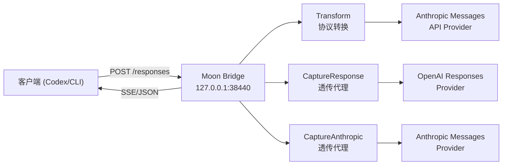
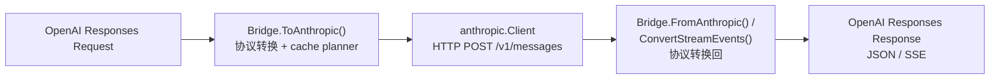

# Moon Bridge 架构

Moon Bridge 是一个 Go 中间层服务，提供 OpenAI Responses API 兼容接口，在背后将请求转换为 Anthropic Messages API 并转发至上游 Provider。

## 架构总览



## 运行模式

Moon Bridge 支持三种运行模式，由 `config.yml` 中的 `mode` 字段控制：

### Transform（默认）

协议转换模式。接收 OpenAI Responses 请求，转为 Anthropic Messages 请求发送至上游 Provider，再将响应转换回 OpenAI Responses 格式返回。

数据流：



### CaptureResponse

透明代理模式。请求按 OpenAI Responses 协议原样转发至上游 OpenAI-compatible Provider，不做协议转换。用于抓取 Codex 原生 Responses 请求作为协议对齐基准。

### CaptureAnthropic

透明代理模式。请求按 Anthropic Messages 协议原样转发至上游 Provider。用于抓取 Claude Code 或其他 Anthropic 客户端的真实请求。

## 模块分层

### cmd/moonbridge

项目唯一入口。解析命令行标志（`-config`, `-addr`, `-mode` 等），通过 `app.RunServer` 启动对应模式的服务。

```bash
# Transform 模式（默认）
./moonbridge

# CaptureResponse 模式
./moonbridge -mode CaptureResponse

# 打印配置的监听地址（供脚本使用）
./moonbridge -print-addr

# 打印 Codex 兼容的 config.toml
./moonbridge -print-codex-config moonbridge -codex-base-url http://127.0.0.1:38440
```

### internal/config

集中管理 YAML 配置。

- 读取 `config.yml`（或 `MOONBRIDGE_CONFIG` 环境变量指定路径）。
- 使用 `yaml.v3` `KnownFields(true)` 严格解析，防止字段拼写错误。
- 校验 mode、必填字段（base_url / api_key / models）、缓存参数。
- 提供 `ModelFor()` 将客户端传入的模型别名映射为上游真实模型名，并读取 `provider.web_search.support` 控制搜索工具是否自动探测/强制启用/禁用。

### internal/app

应用组装层。根据 mode 创建 Anthropic client、Bridge、trace tracer、HTTP handler，启动 HTTP server。

Transform 模式下，如果 `provider.web_search.support: auto`，启动时会用默认模型发送一次流式轻量 `web_search_20250305` 工具声明探测；只有探测证明可用才注入，否则进程内保守禁用 Codex `web_search` 工具注入。

`provider.web_search.support: injected` 模式：不依赖 Provider 服务端搜索工具。桥接器将 `web_search_preview` 转为向模型注入 `tavily_search` / `firecrawl_fetch` 两个 function-type 工具，并在 Transform 启动时创建 websearch injected orchestrator 包裹底层 Provider 客户端。模型调用这些工具时，orchestrator 通过 Tavily / Firecrawl API 执行搜索并回传结果，搜索过程对 Codex 透明。

### internal/server

HTTP 服务器层。提供 `/v1/responses` 和 `/responses` 两个 POST 端点。

- 解析请求体为 `openai.ResponsesRequest`。
- 调用 `Bridge.ToAnthropic()` 转换并拿到 cache 计划。
- 非流式：调用 Provider `CreateMessage()` → `Bridge.FromAnthropicWithPlanAndContext()` 转换回 → JSON 响应。
- 流式：调用 Provider `StreamMessage()` → 收集所有 SSE 事件 → `Bridge.ConvertStreamEventsWithContext()` 批量转换 → 写入 SSE 流。
- 请求/响应经 trace 系统记录。
- 错误处理分两层：
  - Bridge 层返回的 `RequestError` 直接转为 OpenAI 错误格式。
  - Anthropic Provider 错误通过 `ProviderError.OpenAIStatus()` 映射为等价 HTTP 状态码。

### internal/bridge

协议转换核心模块。

- **`ToAnthropic()`**：将 OpenAI Responses Request 转为 Anthropic MessageRequest。处理 input、tools、tool_choice、历史消息合并、namespace 展平、web_search 工具桥接。
- **`FromAnthropicWithPlanAndContext()`**：将 Anthropic MessageResponse 转为 OpenAI Response。处理 tool_use → function_call / local_shell_call / custom_tool_call 映射，namespace function 回拆，web_search_call 过滤，usage 归一化。
- **`ConvertStreamEventsWithContext()`**：逐事件将 Anthropic SSE 流转为 OpenAI 流。管理 content_block 级别的 state 跟踪，处理 text / tool_use / server_tool_use 三种 block 类型的流式拼接。
- **`ConversionContext`**：缓存本轮请求的 custom tool 集合、grammar kind 和 namespace function 映射，确保 custom grammar 工具不被当成普通 function_call 处理，并能在响应侧拼回 raw custom input / 拆回 Codex namespace。
- **`convertInput()`**：历史消息转换的关键逻辑：连续 `function_call` / `local_shell_call` 归并为同一个 assistant `tool_use` 消息，连续工具输出归并为随后的 user `tool_result` 消息。
- **`ErrorResponse()`**：统一错误映射，区分请求校验错误和 Provider 错误。

### internal/cache

Prompt cache 管理和规划。

- **`MemoryRegistry`**：内存级别的缓存状态记录（warming / warm / expired / missed），按 `localKey`（基于 Provider、模型、TTL、工具/系统/消息 hash 的复合键）索引。
- **`Planner`**：根据 PlannerConfig（mode / TTL / breakpoints / min tokens）和 Registry 状态，生成 `CacheCreationPlan`。plan 包含顶层 `cache_control` 策略和块级断点位置。
- **`injectCacheControl()`** 在 `Bridge` 中：按 plan 向 Anthropic 请求的 tools、system、messages 末尾注入 `cache_control`。
- 缓存 TTL 支持 `5m`（ephemeral）和 `1h`。`automatic` 模式发送顶层 `cache_control`，`explicit` 模式发送块级断点，`hybrid` 模式两者兼有。

### internal/anthropic

Anthropic Messages API HTTP 客户端。

- `CreateMessage()`：POST `/v1/messages`，返回完整响应。
- `StreamMessage()`：POST `/v1/messages`（`stream: true`），返回 SSE 读取器。
- `sseStream`：逐行解析 SSE 格式，分隔 event 和 data，反序列化为 `StreamEvent`。
- `ProviderError`：封装上游 HTTP 错误，包含 status code、error type、request ID。

### internal/openai

OpenAI Responses 协议 DTO 定义。包含 `ResponsesRequest`、`Response`、`OutputItem`、`Usage`、`InputTokensDetails`（`cached_tokens` 无 `omitempty`，始终序列化）、以及全部 SSE 事件类型。

### internal/extensions

Provider 扩展模块。当前包含 DeepSeek V4 扩展（`deepseek_v4`），处理 reasoning_content 剥离与重注入、reasoning_effort → thinking 映射、流式 thinking 跟踪等 Provider 特有行为。其他 Provider 特有逻辑可直接在此目录下新增子包。

### internal/proxy

透明代理实现。`ResponseServer` 和 `AnthropicServer` 分别对应两种协议的透明代理。均继承自共同的 `common.go` 中的 `copyHeaders`、`copyStreaming`、`upstreamURL` 等基础工具函数。

### internal/trace

请求/响应转储系统。

- 目录结构：
  - Transform 模式：`trace/Transform/{session_id}/Response/{n}.json` 和 `trace/Transform/{session_id}/Anthropic/{n}.json`
  - Capture 模式：`trace/Capture/{Response|Anthropic}/{session_id}/{n}.json`
- 序列化时自动脱敏 `Authorization`、`x-api-key` 等敏感 Header（替换为 `[REDACTED]`）。
- 文件权限 600，目录权限 700。

## 关键设计决策

### 协议兼容性

- 支持 `/responses` 和 `/v1/responses` 两个路径，兼容 Codex CLI 的不同路由约定。
- `usage.input_tokens_details.cached_tokens` 即使为 0 也序列化输出，避免 Codex 压缩上下文时解析失败。
- `local_shell_call` 使用独立 JSON schema 和 output item 类型，不走普通 `function_call` 路径。
- `web_search_call` 流式中 `input_json_delta` 不产生 `function_call_arguments.delta`，而是并入 `action` 字段；当 Provider 探测不支持 web search 时，不向上游注入搜索工具。
- 空 `text_delta` / 空 `output_text` 不再生成 message 输出或 Anthropic `text` block，避免下一轮工具历史里出现 `{"type":"text"}` 这种缺少 `text` 字段的非法内容。

### 消息顺序

Anthropic Messages API 要求轮次内 `tool_use` block 不能跨消息分割。Bridge 在历史转换时将连续的工具调用归并到同一 `assistant` 消息，相应结果归并到连续的 `user` 消息，确保兼容。

### Cache 策略

- `explicit_cache_breakpoints` + `automatic_prompt_cache: false` 是推荐的保守配置，匹配 Claude Code 抓包行为。
- `automatic` + `explicit` 同时开启时为 `hybrid` 模式，实测可在第二轮达到全输入缓存命中（`cache_read_input_tokens` ≈ 全部 input_tokens）。

### 工具映射

- `namespace` 工具在 Anthropic 侧展平为 `mcp__deepwiki__ask_question` 样式；响应回 Codex 时按本轮 `ConversionContext` 拆回 `namespace:"mcp__deepwiki__"` + `name:"ask_question"`，历史回放和 `tool_choice` 再拼回 Anthropic 扁平名。
- DeepWiki 确认 Codex 内置 grammar/freeform 工具主要是 `apply_patch` 和 Code Mode `exec`；Moon Bridge 依赖 `format.definition` 识别 grammar kind，而不是只看工具名。
- `apply_patch` 在 Anthropic 侧拆成 `apply_patch_add_file`、`apply_patch_delete_file`、`apply_patch_update_file`、`apply_patch_replace_file`、`apply_patch_batch` 工具集合，响应时统一回映射为 Codex `apply_patch` custom call 并拼回 `*** Begin Patch` / `*** End Patch` raw grammar；proxy 描述只讲结构化 JSON 操作，不再带 Codex 原始 `FREEFORM` / grammar 提示。`replace_file` 和 `update_file + content` 会转成 `Delete File` + `Add File` 的整文件替换，避免生成空 Update hunk。
- Code Mode `exec` 在 Anthropic 侧暴露为 `{source: string}` schema，响应时把 `source` 原样拼回 Codex custom tool input；proxy 描述同样不暴露原始 grammar。
- DeepWiki / MCP 的具体使用约束属于代理提示词层，由 `AGENTS.md` 管理；Transform 层只负责按协议展平和转发工具定义，不改写 MCP 工具说明。

## 多 Provider & 会话隔离

Moon Bridge v2 支持多 Provider 架构和每请求会话隔离：

### Provider 路由

- **ProviderManager** (`internal/provider/`) 管理多个上游 Provider 客户端
- 配置中通过 `provider.providers` 定义多个 Provider（DeepSeek、OpenAI、Anthropic 等）
- `provider.models` 中的每个模型别名可指定 `provider` 键，决定请求发往哪个上游
- 每个 Provider 拥有独立的 `http.Client` 和连接池配置
- 旧格式（单 `base_url`/`api_key`）自动映射为 `providers.default`，完全向下兼容

### 会话隔离

- **Session** (`internal/session/`) 为每请求创建独立状态容器
- DeepSeek V4 thinking 缓存从全局 `Bridge` 移至 Session 内
- 并发请求的 thinking 状态互不干扰
- Session 在请求创建时分配，请求完成后由 GC 回收

### 连接池

- 每个 Provider 使用独立的 `http.Transport`，配置 `MaxIdleConnsPerHost` / `IdleConnTimeout`
- 默认值：4 连接/主机，90 秒空闲超时
- SSE 流式请求天然保活

```
flowchart LR
    client["客户端 (Codex/CLI)"]
    mb["Moon Bridge\n127.0.0.1:38440"]

    subgraph Transform["Transform 内部"]
        bridge["Bridge\n协议转换"]
        session["Session\n(每请求)"]
        pm["ProviderManager\n路由"]
        ds["DeepSeek Provider"]
        oai["OpenAI Provider"]
        ant["Anthropic Provider"]
    end

    client -- POST /responses --> mb
    mb --> bridge
    bridge --> session
    session --> pm
    pm -- model=moonbridge --> ds
    pm -- model=gpt-image --> oai
    pm -- model=claude --> ant
    ds --> bridge
    oai --> bridge
    ant --> bridge
    bridge -- SSE/JSON --> client
```
