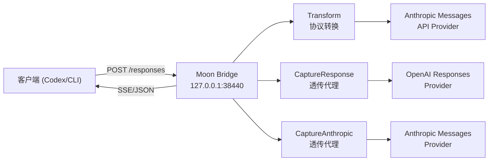
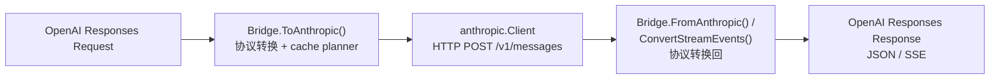

# Moon Bridge 架构

Moon Bridge 是一个 Go 中间层服务，提供 OpenAI Responses API 兼容接口，在背后将请求转换为 Anthropic Messages API 并转发至上游 Provider。

## 架构总览



## 运行模式

Moon Bridge 支持三种运行模式，由 `config.yml` 中的 `mode` 字段控制：

### Transform（默认）

协议转换模式。接收 OpenAI Responses 请求，转为 Anthropic Messages 请求发送至上游 Provider，再将响应转换回 OpenAI Responses 格式返回。

数据流：



### CaptureResponse

透明代理模式。请求按 OpenAI Responses 协议原样转发至上游 OpenAI-compatible Provider，不做协议转换。用于抓取 Codex 原生 Responses 请求作为协议对齐基准。

### CaptureAnthropic

透明代理模式。请求按 Anthropic Messages 协议原样转发至上游 Provider。用于抓取 Claude Code 或其他 Anthropic 客户端的真实请求。

## 模块分层

### cmd/moonbridge

项目唯一入口。解析命令行标志（`-config`, `-addr`, `-mode` 等），通过 `app.RunServer` 启动对应模式的服务。

```bash
# Transform 模式（默认）
./moonbridge

# CaptureResponse 模式
./moonbridge -mode CaptureResponse

# 打印配置的监听地址（供脚本使用）
./moonbridge -print-addr

# 打印 Codex 兼容的 config.toml
./moonbridge -print-codex-config moonbridge -codex-base-url http://127.0.0.1:38440
```

### internal/config

集中管理 YAML 配置。

- 读取 `config.yml`（或 `MOONBRIDGE_CONFIG` 环境变量指定路径）。
- 使用 `yaml.v3` `KnownFields(true)` 严格解析，防止字段拼写错误。
- 校验 mode、必填字段（base_url / api_key / models）、缓存参数。
- 提供 `ModelFor()` 将客户端传入的模型别名映射为上游真实模型名。

### internal/app

应用组装层。根据 mode 创建 Anthropic client、Bridge、trace tracer、HTTP handler，启动 HTTP server。

### internal/server

HTTP 服务器层。提供 `/v1/responses` 和 `/responses` 两个 POST 端点。

- 解析请求体为 `openai.ResponsesRequest`。
- 调用 `Bridge.ToAnthropic()` 转换并拿到 cache 计划。
- 非流式：调用 Provider `CreateMessage()` → `Bridge.FromAnthropicWithPlanAndContext()` 转换回 → JSON 响应。
- 流式：调用 Provider `StreamMessage()` → 收集所有 SSE 事件 → `Bridge.ConvertStreamEventsWithContext()` 批量转换 → 写入 SSE 流。
- 请求/响应经 trace 系统记录。
- 错误处理分两层：
  - Bridge 层返回的 `RequestError` 直接转为 OpenAI 错误格式。
  - Anthropic Provider 错误通过 `ProviderError.OpenAIStatus()` 映射为等价 HTTP 状态码。

### internal/bridge

协议转换核心模块。

- **`ToAnthropic()`**：将 OpenAI Responses Request 转为 Anthropic MessageRequest。处理 input、tools、tool_choice、历史消息合并、namespace 展平、web_search 工具桥接。
- **`FromAnthropicWithPlanAndContext()`**：将 Anthropic MessageResponse 转为 OpenAI Response。处理 tool_use → function_call / local_shell_call / custom_tool_call 映射，web_search_call 过滤，usage 归一化。
- **`ConvertStreamEventsWithContext()`**：逐事件将 Anthropic SSE 流转为 OpenAI 流。管理 content_block 级别的 state 跟踪，处理 text / tool_use / server_tool_use 三种 block 类型的流式拼接。
- **`ConversionContext`**：缓存本轮请求的 custom tool 集合和 grammar kind，确保 custom grammar 工具不被当成普通 function_call 处理，并能在响应侧拼回 raw custom input。
- **`convertInput()`**：历史消息转换的关键逻辑：连续 `function_call` / `local_shell_call` 归并为同一个 assistant `tool_use` 消息，连续工具输出归并为随后的 user `tool_result` 消息。
- **`ErrorResponse()`**：统一错误映射，区分请求校验错误和 Provider 错误。

### internal/cache

Prompt cache 管理和规划。

- **`MemoryRegistry`**：内存级别的缓存状态记录（warming / warm / expired / missed），按 `localKey`（基于 Provider、模型、TTL、工具/系统/消息 hash 的复合键）索引。
- **`Planner`**：根据 PlannerConfig（mode / TTL / breakpoints / min tokens）和 Registry 状态，生成 `CacheCreationPlan`。plan 包含顶层 `cache_control` 策略和块级断点位置。
- **`injectCacheControl()`** 在 `Bridge` 中：按 plan 向 Anthropic 请求的 tools、system、messages 末尾注入 `cache_control`。
- 缓存 TTL 支持 `5m`（ephemeral）和 `1h`。`automatic` 模式发送顶层 `cache_control`，`explicit` 模式发送块级断点，`hybrid` 模式两者兼有。

### internal/anthropic

Anthropic Messages API HTTP 客户端。

- `CreateMessage()`：POST `/v1/messages`，返回完整响应。
- `StreamMessage()`：POST `/v1/messages`（`stream: true`），返回 SSE 读取器。
- `sseStream`：逐行解析 SSE 格式，分隔 event 和 data，反序列化为 `StreamEvent`。
- `ProviderError`：封装上游 HTTP 错误，包含 status code、error type、request ID。

### internal/openai

OpenAI Responses 协议 DTO 定义。包含 `ResponsesRequest`、`Response`、`OutputItem`、`Usage`、`InputTokensDetails`（`cached_tokens` 无 `omitempty`，始终序列化）、以及全部 SSE 事件类型。

### internal/proxy

透明代理实现。`ResponseServer` 和 `AnthropicServer` 分别对应两种协议的透明代理。均继承自共同的 `common.go` 中的 `copyHeaders`、`copyStreaming`、`upstreamURL` 等基础工具函数。

### internal/trace

请求/响应转储系统。

- 目录结构：
  - Transform 模式：`trace/Transform/{session_id}/Response/{n}.json` 和 `trace/Transform/{session_id}/Anthropic/{n}.json`
  - Capture 模式：`trace/Capture/{Response|Anthropic}/{session_id}/{n}.json`
- 序列化时自动脱敏 `Authorization`、`x-api-key` 等敏感 Header（替换为 `[REDACTED]`）。
- 文件权限 600，目录权限 700。

## 关键设计决策

### 协议兼容性

- 支持 `/responses` 和 `/v1/responses` 两个路径，兼容 Codex CLI 的不同路由约定。
- `usage.input_tokens_details.cached_tokens` 即使为 0 也序列化输出，避免 Codex 压缩上下文时解析失败。
- `local_shell_call` 使用独立 JSON schema 和 output item 类型，不走普通 `function_call` 路径。
- `web_search_call` 流式中 `input_json_delta` 不产生 `function_call_arguments.delta`，而是并入 `action` 字段。

### 消息顺序

Anthropic Messages API 要求轮次内 `tool_use` block 不能跨消息分割。Bridge 在历史转换时将连续的工具调用归并到同一 `assistant` 消息，相应结果归并到连续的 `user` 消息，确保兼容。

### Cache 策略

- `explicit_cache_breakpoints` + `automatic_prompt_cache: false` 是推荐的保守配置，匹配 Claude Code 抓包行为。
- `automatic` + `explicit` 同时开启时为 `hybrid` 模式，实测可在第二轮达到全输入缓存命中（`cache_read_input_tokens` ≈ 全部 input_tokens）。

### 工具映射

- `namespace` 工具展平：`mcp__deepwiki__ask_question` 样式，匹配 Codex 回收 function call 时的命名格式。
- DeepWiki 确认 Codex 内置 grammar/freeform 工具主要是 `apply_patch` 和 Code Mode `exec`；Moon Bridge 依赖 `format.definition` 识别 grammar kind，而不是只看工具名。
- `apply_patch` 在 Anthropic 侧暴露为 `operations` schema，响应时拼回 `*** Begin Patch` / `*** End Patch` raw grammar；内部仍接受 `raw_patch` 作为历史容错，但不在 schema 中暴露。
- Code Mode `exec` 在 Anthropic 侧暴露为 `{source: string}` schema，响应时把 `source` 原样拼回 Codex custom tool input。
