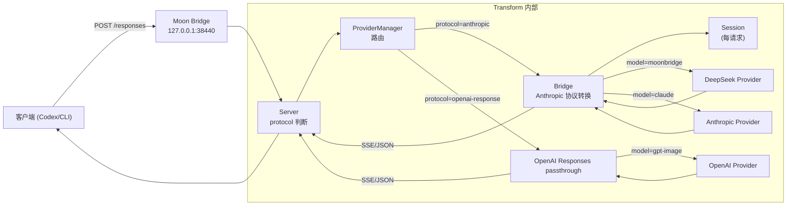

# 系统架构

## 项目概述

Moon Bridge 是一个 Go 语言编写的 HTTP 代理/转换服务器。它接收来自 Codex CLI 的 OpenAI Responses API 请求（`/v1/responses`），将其转换为 Anthropic Messages API 请求，转发给上游 LLM 提供商，再将上游响应转换回 OpenAI Responses 格式。

## 三层架构

```
┌─────────────────────────────────────────────────────┐
│                   Service 层                        │
│  server (路由/处理/日志/统计)  │  proxy (直通代理)  │
│  provider (多提供商路由)       │  stats (用量统计)  │
│  trace (请求跟踪)              │  session (会话)    │
├─────────────────────────────────────────────────────┤
│                  Protocol 层                          │
│  bridge (协议转换核心)   │  anthropic (客户端/类型)  │
│  cache (缓存规划)       │                            │
├─────────────────────────────────────────────────────┤
│                 Foundation 层                        │
│  config (配置加载/校验) │  logger (日志)            │
│  openai (共享 DTO)      │  modelref (模型引用解析)  │
│  session (会话类型)     │                            │
├─────────────────────────────────────────────────────┤
│                 Extension 层                         │
│  plugin (Plugin 接口+注册表)  │  pluginhooks (适配)  │
│  codex (Codex 兼容性)         │                     │
│  deepseek_v4    │  websearch    │  websearchinjected │
└─────────────────────────────────────────────────────┘
```

### Foundation 层

基础组件层，提供低级别能力：

- **`internal/foundation/config`**：YAML 配置加载、结构校验、多模式支持。`FileConfig` 是 YAML 映射结构，`Config` 是运行时使用的扁平化/合并后结构。
- **`internal/foundation/logger`**：基于 `slog` 的带缓冲日志系统，支持 `LogConsumer` 插件拦截日志条目。
- **`internal/foundation/openai`**：共享的 OpenAI Responses API DTO（`ResponsesRequest`、`Response`、`OutputItem`、`Usage`、`StreamEvent` 等），供 bridge、codex、server 等多个包引用，避免循环依赖。
- **`internal/foundation/modelref`**：统一的模型引用解析器，支持 `provider/model` 和 `model(provider)` 两种格式。
- **`internal/foundation/session`**：会话管理，携带 `ExtensionData` 用于插件的跨请求状态保持。

### Protocol 层

核心协议转换层：

- **`internal/protocol/bridge`**：协议转换核心。`Bridge` 结构体负责：
  - `ToAnthropic()`: 将 OpenAI `ResponsesRequest` 转换为 Anthropic `MessageRequest`
  - `FromAnthropic()`: 将 Anthropic `MessageResponse` 转换为 OpenAI `Response`
  - `ConvertStreamEvents()`: 将 Anthropic 流事件序列转换为 OpenAI 流事件序列
  - 工具转换、输入转换、缓存规划、错误映射
  - 通过 `PluginHooks` 结构体与 Extension 系统集成
- **`internal/protocol/anthropic`**：Anthropic Messages API 类型定义（`MessageRequest`、`MessageResponse`、`ContentBlock` 等）和 HTTP 客户端（`Client`），支持 SSE 流式读取、Web Search 探测。
- **`internal/protocol/cache`**：缓存规划引擎。`Planner` 根据配置和请求上下文决定如何注入 Anthropic 缓存控制标记，`MemoryRegistry` 跟踪缓存状态。

### Service 层

应用服务层，组装各组件并对外提供服务：

- **`internal/service/server`**：HTTP 服务器。处理 `/v1/responses`（POST）和 `/v1/models`（GET）。负责请求路由（判断模型走 Anthropic 转换还是 OpenAI 直通）、会话管理、流式 SSE 输出、用量统计、请求跟踪。
- **`internal/service/provider`**：多提供商管理。`ProviderManager` 维护多个 `anthropic.Client` 实例，按模型别名路由到对应提供商，支持协议自动发现和 Web Search 模式探测。
- **`internal/service/proxy`**：Capture 模式下的直通代理。`AnthropicServer` / `ResponseServer` 简单转发 HTTP 请求/响应（可选跟踪）。
- **`internal/service/stats`**：会话用量统计。累计 token 和费用、支持按模型细分、缓存命中率计算、格式化输出。
- **`internal/service/trace`**：请求跟踪。将每次请求的 HTTP 请求/响应、转换后的 Anthropic 请求/响应、流事件序列写入磁盘。

### Extension 层

可插拔扩展层：

- **`internal/extension/plugin`**：Plugin 接口定义和注册表（详见 [Extension 系统](extension-system.md)）。
- **`internal/extension/pluginhooks`**：`PluginHooksFromRegistry()` 将 `plugin.Registry` 适配为 `bridge.PluginHooks` 函数集，避免 bridge 直接依赖 plugin 包。
- **`internal/extension/codex`**：Codex CLI 兼容性工具包。包含模型目录 DTO 生成、工具编解码（custom tool / apply_patch / exec / local_shell 的输入输出转换）、流适配器、默认指令模板。
- **`internal/extension/deepseek_v4`**：DeepSeek V4 扩展（详见 [Extension 一览](extensions-overview.md)）。
- **`internal/extension/websearch`**：Web Search 核心模块。Tavily 搜索客户端、Firecrawl 抓取客户端、搜索编排器（`Orchestrator`）、工具定义生成。
- **`internal/extension/websearchinjected`**："注入式" Web Search 模式扩展，将 `tavily_search` 和 `firecrawl_fetch` 作为 function-type tool 注入到 Anthropic 请求中。

## 三种运行模式

### Transform（默认模式）

完整的协议转换模式：

```
Codex CLI  ──→  Moon Bridge  ──→  LLM Provider
 (OpenAI       /v1/responses     (Anthropic
  Responses)   协议转换           Messages)
```

处理流程：

1. Codex CLI 发送 OpenAI Responses 格式的 POST 请求到 `/v1/responses`
2. Server 解析 `ResponsesRequest`
3. 如果模型的 protocol 是 `openai-response`，直接直通到上游 OpenAI Responses 端点
4. 否则：
   - `Bridge.ToAnthropic()` 转换请求
   - 通过 `ProviderManager` 路由到对应提供商
   - 上游返回后，`Bridge.FromAnthropic()`/`ConvertStreamEvents()` 转换响应
5. 记录用量统计、写入跟踪

### CaptureAnthropic

纯代理模式，不进行任何协议转换，直接转发 Anthropic Messages API 请求：

```
Client  ──→  Moon Bridge  ──→  Anthropic Provider
           (透明代理，可选跟踪)
```

### CaptureResponse

纯代理模式，转发 OpenAI Responses API 请求：

```
Client  ──→  Moon Bridge  ──→  OpenAI Responses Provider
           (透明代理，可选跟踪)
```

## 请求生命周期数据流

集中管理 YAML 配置。

- 使用 `yaml.v3` `KnownFields(true)` 严格解析，防止字段拼写错误。
- 校验 `mode`、`log`（level/format）、`system_prompt`、多 Provider 必填字段（`provider.providers.*.base_url` / `api_key` / `protocol`）、模型路由和缓存参数。
- 提供 `ModelFor()` 将客户端模型别名映射为上游真实模型名，并读取 web search 配置控制搜索工具是否自动探测、强制启用、禁用或 server-side injected。
- web search 配置支持三级覆盖：route → model（provider catalog）→ provider → 全局。推荐在 `providers.<key>.models.<name>.web_search` 按模型单独配置。
- `WebSearchForModel()` 按模型别名解析 web search 配置（route → model → provider → global）；`WebSearchMaxUsesForModel()` / `WebSearchTavilyKeyForModel()` / `WebSearchFirecrawlKeyForModel()` / `WebSearchMaxRoundsForModel()` 同理。
- 保留 `WebSearchForProvider()` 等 per-provider 方法作为内部回退。

### internal/service/app

应用组装层。根据 mode 创建 ProviderManager、Bridge、trace tracer、HTTP handler、session 统计器，启动 HTTP server。

Transform 模式下，`resolvePerProviderWebSearch()` 分两步解析 web search 支持状态：

1. 遍历所有 Provider，按 per-provider 配置或全局回退解析 provider 级别默认值（非 Anthropic 协议自动禁用）。
2. 遍历所有 route，对有模型级别 web search 覆盖的别名单独解析，结果以 `model:<alias>` 为 key 存入 `resolvedWS`。

支持的模式：`disabled`、`enabled`、`injected`、`auto`（探测）。`auto` 模式下，模型级别探测使用该模型的上游名称发送轻量 `web_search_20250305` 工具声明探测。

解析结果通过 `ProviderManager.SetResolvedWebSearch()` 存储；`ResolvedWebSearchForModel()` 查询时优先检查 `model:<alias>` key，未找到时回退到 provider key。`injected` 模式由 server 层在请求时按模型动态包装。

Visual 扩展同样在 Transform 模式装配：`visual.Plugin` 只负责给启用的模型注入 `visual_brief` / `visual_qa` 工具，真实视觉调用由 server 层用现有 Anthropic provider client 包装执行，不引入独立 Kimi 桥接。

### internal/service/provider

多 Provider 路由层。

- `ProviderManager` 管理多个上游 Provider 的 HTTP client。
- 模型定义在 `provider.providers.<key>.models` 下，所属 Provider 由父级 key 隐式决定。
- `provider.providers.<key>.protocol` 决定该 Provider 走 Anthropic 转换还是 OpenAI Responses 直通。
- 每个 Provider 拥有独立连接池，默认每主机 4 个 idle 连接、90 秒空闲超时。
- `ProviderManager.resolvedWS`（`map[string]string`）存储解析后的 web search 状态，key 为 provider key 或 `model:<alias>`。
- `ResolvedWebSearchForModel()` 优先查找 `model:<alias>` key，未找到时回退到 provider key。
- 新增 `FirstUpstreamModelForKey()` 返回某个 provider key 下第一个路由到该 provider 的上游模型名，用于 auto 模式探测。

### internal/extension/codex

Codex 客户端兼容逻辑集中层，将原先散落在 `internal/protocol/bridge`、`internal/service/server` 和 `cmd/moonbridge` 的 Codex 专属代码抽取到独立包中。

目录结构：

```text
internal/extension/codex/
├── catalog.go          # ModelInfo / BuildModelInfoFromRoute / BuildModelInfosFromConfig / GenerateConfigToml / WriteModelsCatalog
├── tool_context.go     # ConversionContext / CustomToolSpec / FunctionToolSpec / CustomToolKind
├── customtool.go       # apply_patch / exec grammar 代理与 raw input 重建
├── tools.go            # LocalShellSchema / NamespacedToolName / ToolCodec / OutputItem helpers
└── catalog_test.go     # 单元测试

```
POST /v1/responses
  │
  ├─ Server 解析请求体 JSON
  ├─ Session 查找/创建
  │
  ├─ [protocol = openai-response] ──→ 直接直通上游
  │
  ├─ Bridge.ConversionContext() ──→ 构建工具上下文
  ├─ Bridge.ToAnthropic()
  │   ├─ PluginHooks.PreprocessInput()   [InputPreprocessor]
  │   ├─ convertInput() → messages + system
  │   │   ├─ PluginHooks.RewriteMessages() [MessageRewriter]
  │   │   └─ codex.ConvertInputItem()     [Codex 类型]
  │   ├─ convertTools() → tools
  │   │   ├─ codex.ConvertCodexTool()     [Codex 类型]
  │   │   └─ PluginHooks.InjectTools()    [ToolInjector]
  │   ├─ PluginHooks.MutateRequest()       [RequestMutator]
  │   └─ cache.PlanCache() → 缓存规划
  │
  ├─ resolveProvider() → 选择 Provider
  │   └─ maybeWrapInjectedSearch() → 注入 Web Search 编排器
  │
  ├─ [streaming]
  │   ├─ Provider.StreamMessage() → 流事件
  │   ├─ Bridge.ConvertStreamEvents() → SSE 输出
  │   │   └─ StreamAdapter + PluginHooks (StreamInterceptor)
  │   └─ 关闭流
  │
  └─ [non-streaming]
      ├─ Provider.CreateMessage() → 完整响应
      ├─ Bridge.FromAnthropic() → OpenAI 格式
      └─ JSON 响应
```

## 模型路由

Moon Bridge 支持多提供商和多模型路由。配置通过 `provider.providers` 定义提供商及其模型目录，`provider.routes` 定义路由别名。

### 模型引用格式

支持两种格式，由 `modelref` 包统一解析：

- `provider/model`（如 `deepseek/deepseek-chat`）
- `model(provider)`（如 `deepseek-chat(deepseek)`）

### 路由解析优先级

- 解析请求体为 `openai.ResponsesRequest`。
- 根据模型别名判断 Provider protocol。
- `openai-response`：改写上游模型名，直接代理到上游 `/v1/responses`，并从上游 `usage` 中累计 session 统计。
- Anthropic protocol：调用 `Bridge.ToAnthropic()` 转换并拿到 cache 计划。
- 新增 `AppConfig` 字段存储完整配置，用于按模型别名解析 web search 参数。
- `resolveProvider()` 调用 `maybeWrapProvider()`，根据模型配置动态包装 injected search orchestrator 和 Visual orchestrator。
- Visual 包装器会先从主请求中取出 Anthropic image block，替换为 `Image #1` 这类可引用文本，再在工具循环中把真实图片转发给 `provider.visual.provider` 指向的现有 Anthropic-compatible Provider。
- `resolveRequestOptions()` 按模型别名构建 per-request `bridge.RequestOptions`，包含 `WebSearchMode`、`WebSearchMaxUses`、`FirecrawlAPIKey` 等字段。
- 非流式：调用 Provider `CreateMessage()` → `Bridge.FromAnthropicWithPlanAndContext()` 转换回 → JSON 响应。
- 流式：设置 SSE 头后调用 Provider `StreamMessage()` → 收集所有 SSE 事件 → `Bridge.ConvertStreamEventsWithContext()` 批量转换 → 写入 SSE 流。服务端不再生成 synthetic commentary preamble，避免旧等待提示出现在 UI 或被后续 resume 带回上下文；历史中已存在的 `phase: "commentary"` 消息会在请求转换时跳过。
- Anthropic 转换路径和 OpenAI Responses 直通路径的请求/响应都会经 trace 系统记录，成功和错误场景均写入 trace。
- 成功请求输出可读 Usage 行，模型名使用实际发往上游的模型名，Billing 使用 session 累计费用。
- `/v1/models` 端点返回 Codex `ModelsResponse` 格式（`{"models": [...]}`）。Provider 下声明的 `models` 是主数据源，会以 `provider/upstream_model` 形式完整写入；`routes` 只作为后置 fallback alias 补充。每个 `ModelInfo` 包含 Codex 反序列化所需的全部字段（`slug`、`shell_type`、`visibility`、`truncation_policy`、`supported_reasoning_levels` 等）。`truncation_policy` 使用非零默认 token limit，避免 Codex unified_exec 工具输出预算被夹成 0 后只返回 `…N tokens truncated…`。
- 错误处理分两层：
  - Bridge 层返回的 `RequestError` 直接转为 OpenAI 错误格式。
  - Anthropic Provider 错误通过 `ProviderError.OpenAIStatus()` 映射为等价 HTTP 状态码。

1. 直接引用：`provider/model` 或 `model(provider)` 格式
2. Routes 映射：`routes` 中的别名
3. 默认模型：`default_model` 配置

## 缓存系统

配置位于 `cache` 节，支持以下模式：

- **`ToAnthropic()`**：将 OpenAI Responses Request 转为 Anthropic MessageRequest。处理 input、tools、tool_choice、历史消息合并、namespace 展平、web_search 工具桥接。
- `input_image` / `image_url` 内容会转换为 Anthropic `image` block。启用 Visual 时，这些图片会在进入主模型前由 Visual orchestrator 接管，主模型只看到 `Image #n` 引用提示。
- `ToAnthropic()` 新增 `opts ...RequestOptions` 可变参数，接收 per-request 的 web search 配置。
- 新增 `RequestOptions` 结构体，包含 `WebSearchMode`、`WebSearchMaxUses`、`FirecrawlAPIKey` 等字段，由 server 层按 provider key 构建。
- `convertTools()` 根据 per-request `RequestOptions.WebSearchMode` 而非全局 config 决定 web search 行为。
- `ToAnthropic()` 在基础工具转换后会调用启用插件的 `ToolInjector`，用于把插件提供的 Anthropic 工具追加到本轮请求。
- **`FromAnthropicWithPlanAndContext()`**：将 Anthropic MessageResponse 转为 OpenAI Response。处理 tool_use → function_call / local_shell_call / custom_tool_call 映射，namespace function 回拆，web_search_call 过滤，usage 归一化。
- **`ConvertStreamEventsWithContext()`**：逐事件将 Anthropic SSE 流转为 OpenAI 流。管理 content_block 级别的 state 跟踪，处理 text / tool_use / server_tool_use 三种 block 类型的流式拼接。
- **`ConversionContext`**：缓存本轮请求的 custom tool 集合、grammar kind 和 namespace function 映射，确保 custom grammar 工具不被当成普通 function_call 处理，并能在响应侧拼回 raw custom input / 拆回 Codex namespace。
- **`convertInput()`**：历史消息转换的关键逻辑：连续 `function_call` / `local_shell_call` 归并为同一个 assistant `tool_use` 消息，连续工具输出归并为随后的 user `tool_result` 消息。
- **`ErrorResponse()`**：统一错误映射，区分请求校验错误和 Provider 错误。

### internal/protocol/cache

Prompt cache 管理和规划。

- **`MemoryRegistry`**：内存级别的缓存状态记录（warming / warm / expired / missed），按 `localKey`（基于 Provider、模型、TTL、工具/系统/消息 hash 的复合键）索引。
- **`Planner`**：根据 PlannerConfig（mode / TTL / breakpoints / min tokens）和 Registry 状态，生成 `CacheCreationPlan`。plan 包含顶层 `cache_control` 策略和块级断点位置；长会话下会把剩余断点预算分配到更早的消息前缀，而不是只缓存最后一条消息。
- **`injectCacheControl()`** 在 `Bridge` 中：按 plan 向 Anthropic 请求的 tools、system 和选中的 message prefix block 注入 `cache_control`。
- 缓存 TTL 支持 `5m`（ephemeral）和 `1h`。`automatic` 模式发送顶层 `cache_control`，`explicit` 模式发送块级断点，`hybrid` 模式两者兼有。

### internal/protocol/anthropic

Anthropic Messages API HTTP 客户端。

- `CreateMessage()`：POST `/v1/messages`，返回完整响应。
- `StreamMessage()`：POST `/v1/messages`（`stream: true`），返回 SSE 读取器。
- `sseStream`：逐行解析 SSE 格式，分隔 event 和 data，反序列化为 `StreamEvent`。
- `ProviderError`：封装上游 HTTP 错误，包含 status code、error type、request ID。

### internal/foundation/openai

OpenAI Responses 协议 DTO 定义。包含 `ResponsesRequest`、`Response`、`OutputItem`、`Usage`、`InputTokensDetails`（`cached_tokens` 无 `omitempty`，始终序列化）、以及全部 SSE 事件类型。

### internal/extension

Provider 扩展模块。当前包含：

- `deepseek_v4`：按模型级别配置启用（`models.<name>.deepseek_v4: true`），处理 reasoning_content 剥离、thinking 回放、流式 thinking 跟踪等 DeepSeek 特有行为；推理强度使用标准 `reasoning.effort`，其中 `xhigh` 会写入 DeepSeek `output_config.effort=max`。signature-only thinking 会编码进 Codex 可回放的 `reasoning.summary`；旧历史缺失 reasoning/缓存时，仅在请求侧补空 `thinking` block 兜底，不生成空 summary。
- `visual`：按模型级别配置启用（`models.<name>.visual: true`），向主模型注入 `visual_brief` / `visual_qa`，并通过 `provider.visual.provider` 指向的现有 Anthropic provider 执行视觉分析。
- `websearch` / `websearchinjected`：当 web search 配置为 `injected` 时，向模型注入 `tavily_search` / `firecrawl_fetch` 工具，并在服务端执行搜索循环。

其他 Provider 特有逻辑可直接在此目录下新增子包。

### internal/foundation/session

每请求状态容器。当前用于隔离 DeepSeek V4 thinking state，避免并发请求之间互相污染。Session 在 HTTP 请求开始时创建，请求结束后由 GC 回收。

### internal/service/stats

session 级 token 和费用统计。

- `SessionStats.Record()` 累计请求数、输入/输出、cache creation、cache read 和费用。
- `provider.providers.<key>.models.<alias>.pricing` 提供按 M tokens 计价的 input/output/cache write/cache read 价格。
- 每请求 INFO 行展示当前请求 usage 和 session 累计 Billing。
- 服务退出时输出 `Summary：Session Cache Hit Rate(AVG): ... Billing: ... CNY` 以及详细拆解。

### internal/service/proxy

透明代理实现。`ResponseServer` 和 `AnthropicServer` 分别对应两种协议的透明代理。均继承自共同的 `common.go` 中的 `copyHeaders`、`copyStreaming`、`upstreamURL` 等基础工具函数。

### internal/service/trace

请求/响应转储系统。

- 目录结构：
  - Transform 模式：`trace/Transform/{session_id}/{model}/Response/{n}.json` 和 `trace/Transform/{session_id}/{model}/Anthropic/{n}.json`
  - Capture 模式：`trace/Capture/{Response|Anthropic}/{session_id}/{n}.json`
- 序列化时自动脱敏 `Authorization`、`x-api-key` 等敏感 Header（替换为 `[REDACTED]`）。
- 文件权限 600，目录权限 700。

## 关键设计决策

### 协议兼容性

- 支持 `/responses` 和 `/v1/responses` 两个路径，兼容 Codex CLI 的不同路由约定。
- `/v1/models` 响应使用 Codex `ModelsResponse` 格式（`{"models": [...]}`）而非标准 OpenAI `{"object":"list","data":[...]}`，因为 Codex 的 `codex-api` crate 反序列化时期望 `models` 字段。
- Codex 在使用 `env_key`（API key）认证时不会主动拉取 `/models` 端点（`should_refresh_models` 返回 `false`）。因此 `--print-codex-config --codex-home` 会同时生成 `models_catalog.json` 并在 config.toml 中输出 `model_catalog_json` 指向该文件，让 Codex 在启动时直接加载静态 catalog。
- `usage.input_tokens_details.cached_tokens` 即使为 0 也序列化输出，避免 Codex 压缩上下文时解析失败。
- `local_shell_call` 使用独立 JSON schema 和 output item 类型，不走普通 `function_call` 路径。
- `web_search_call` 流式中 `input_json_delta` 不产生 `function_call_arguments.delta`，而是并入 `action` 字段；当 Provider 探测不支持 web search 时，不向上游注入搜索工具；`injected` 模式则改为服务端 Tavily/Firecrawl 工具循环。
- web search 支持按模型独立判断：每个模型根据其 resolved web search mode（`enabled` / `disabled` / `injected` / auto 探测结果）决定是否向上游注入搜索工具或启用服务端 Tavily/Firecrawl 工具循环。`openai-response` 协议的 Provider 会在 `enabled` 时自动注入 OpenAI Responses 原生 `{"type": "web_search"}` 工具（`injected` 模式因 Tavily/Firecrawl 为 Anthropic 专用，会映射为 `disabled`）。配置优先级：route → model（provider catalog）→ provider → global。
- Visual 是 Anthropic 协议侧工具循环扩展：主模型必须是 Anthropic-routed 模型，视觉 provider 也必须是 Anthropic-compatible Provider。附件引用必须走 `image_refs` 或省略图片字段，`Image #1` 不会被当作 URL 发给视觉 provider。
- 空 `text_delta` / 空 `output_text` 不再生成 message 输出或 Anthropic `text` block，避免下一轮工具历史里出现 `{"type":"text"}` 这种缺少 `text` 字段的非法内容。

### 消息顺序

Anthropic Messages API 要求轮次内 `tool_use` block 不能跨消息分割。Bridge 在历史转换时将连续的工具调用归并到同一 `assistant` 消息，相应结果归并到连续的 `user` 消息，确保兼容。

### Cache 策略

- `explicit_cache_breakpoints` + `automatic_prompt_cache: false` 是推荐的保守配置，匹配 Claude Code 抓包行为。
- `automatic` + `explicit` 同时开启时为 `hybrid` 模式；实际命中率依赖 Provider、模型和请求形态，需以 `cache_read_input_tokens` 为准。

### 工具映射

- `namespace` 工具在 Anthropic 侧展平为 `mcp__deepwiki__ask_question` 样式；响应回 Codex 时按本轮 `ConversionContext` 拆回 `namespace:"mcp__deepwiki__"` + `name:"ask_question"`，历史回放和 `tool_choice` 再拼回 Anthropic 扁平名。
- DeepWiki 确认 Codex 内置 grammar/freeform 工具主要是 `apply_patch` 和 Code Mode `exec`；Moon Bridge 依赖 `format.definition` 识别 grammar kind，而不是只看工具名。
- `apply_patch` 在 Anthropic 侧拆成 `apply_patch_add_file`、`apply_patch_delete_file`、`apply_patch_update_file`、`apply_patch_replace_file`、`apply_patch_batch` 工具集合，响应时统一回映射为 Codex `apply_patch` custom call 并拼回 `*** Begin Patch` / `*** End Patch` raw grammar；proxy 描述只讲结构化 JSON 操作，不再带 Codex 原始 `FREEFORM` / grammar 提示。`replace_file` 和 `update_file + content` 会转成 `Delete File` + `Add File` 的整文件替换，避免生成空 Update hunk。
- Code Mode `exec` 在 Anthropic 侧暴露为 `{source: string}` schema，响应时把 `source` 原样拼回 Codex custom tool input；proxy 描述同样不暴露原始 grammar。
- DeepWiki / MCP 的具体使用约束属于代理提示词层，由 `AGENTS.md` 管理；Transform 层只负责按协议展平和转发工具定义，不改写 MCP 工具说明。

## 多 Provider & 会话隔离

当前版本支持多 Provider 架构和每请求会话隔离：

### Provider 路由

- **ProviderManager** (`internal/service/provider/`) 管理多个上游 Provider 客户端
- 配置中通过 `provider.providers` 定义多个 Provider（DeepSeek、OpenAI、Anthropic 等）
- 模型定义在各 `provider.providers.<key>.models` 下，所属 Provider 由父级 key 隐式决定
- 每个 Provider 拥有独立的 `http.Client` 和连接池配置
- `Bridge.ProviderFor()` 不再硬编码返回 `"default"`，无显式映射时返回空字符串
- server 侧 `resolveProvider()` 使用三级 fallback 链：
  1. `ProviderManager.ClientFor(modelAlias)` — 按 model alias 精确路由
  2. `ClientForKey(providerKey)` — 按 Bridge.ProviderFor 返回的 key 路由
  3. 遍历任意可用 Provider — 最后兜底
- `handleOpenAIResponse()` 在 `Bridge.ProviderFor` 返回空时调用 `ProviderKeyForModel()` 二次解析路由 key
- `app.resolveDefaultClient()` 安全处理无 default provider 场景：defaultKey 为空或 client 不可用时返回 nil，下游 web search probing 和 fallback Provider 包装条件性跳过
- 启动时 `resolvePerProviderWebSearch()` 分两步解析：先按 provider 解析默认值，再按 route 解析模型级别覆盖，结果存入 `ProviderManager.resolvedWS`
- 请求时 `maybeWrapProvider()` 按模型别名包装 injected web search / Visual，`resolveRequestOptions()` 按模型别名解析 web search 配置并传递给 `Bridge.ToAnthropic()`

### 会话隔离

- **Session** (`internal/foundation/session/`) 为每请求创建独立状态容器
- DeepSeek V4 thinking 缓存从全局 `Bridge` 移至 Session 内
- 并发请求的 thinking 状态互不干扰
- Session 在请求创建时分配，请求完成后由 GC 回收

### 连接池

- 每个 Provider 使用独立的 `http.Transport`，配置 `MaxIdleConnsPerHost` / `IdleConnTimeout`
- 默认值：4 连接/主机，90 秒空闲超时
- SSE 流式请求天然保活



### OpenAI Responses 直通

定义 Provider 时可指定 `protocol` 字段：

- `"anthropic"`（默认）：请求经 Bridge 协议转换后以 Anthropic Messages 格式发送到上游
- `"openai"`：请求**不经过 Bridge 转换**，以原始 OpenAI Responses 格式直接透传代理到上游

`openai-response` Provider 会创建一个与上游的直连 HTTP 代理，支持流式（SSE）和非流式响应。适用于：
- 直接对接 OpenAI API（图像生成、TTS、嵌入等不需要 Anthropic 转换的请求）
- 对接其他 OpenAI Responses Provider

### 费用统计

每请求日志（非流式/流式，包括 `openai-response` 直通在响应包含 usage 时）都会输出一行可读 Usage：

```text
{UpstreamModel} Usage: {input_m} M Input, {output_m} M Output, Session Cache Hit Rate: {rate}%, Billing: {total} CNY
```

其中 `{UpstreamModel}` 是实际转发到上游的模型名，`Billing` 是 session 累计费用。每请求 `Input` 展示采用 OpenAI 语义：`input_tokens + cache_read_input_tokens`，不把 `cache_creation_input_tokens` 额外计入展示值；cache creation 仍按 `cache_write_price` 计费，并保留在详细汇总里。

服务器关闭时输出完整会话费用汇总，包含按模型分组的费用明细和缓存命中率：

```text
Summary：Session Cache Hit Rate(AVG): 25.0%, Billing: 3.04 CNY
```

费用依据 `provider.providers.<key>.models.<upstream>.pricing` 配置计算，价格单位是人民币元 / M tokens。价格定义在 Provider 的模型目录中，通过 `routes` 关联到别名后自动生效。

配置示例：

```yaml
provider:
  providers:
    deepseek:
      # ...
      models:
        deepseek-v4-pro:
          deepseek_v4: true
          default_reasoning_level: "high"
          supported_reasoning_levels:
            - effort: "high"
              description: "High reasoning effort"
            - effort: "xhigh"
              description: "Extra high reasoning effort (maps to DeepSeek max)"
          web_search:
            support: "auto"
          pricing:
            input_price: 1          # ¥1 / M tokens
            output_price: 2         # ¥2 / M tokens
            cache_write_price: 0
            cache_read_price: 0.2   # ¥0.2 / M tokens
```

| 模式 | 说明 |
|------|------|
| `off` | 禁用缓存 |
| `automatic` | 仅自动缓存（Anthropic 自动检测前缀） |
| `explicit` | 仅显式缓存控制标记 |
| `hybrid` | 同时使用两种策略 |

`MemoryRegistry` 跟踪每个缓存键的状态（冷/预热中/已预热/过期），支持跨请求缓存复用。
