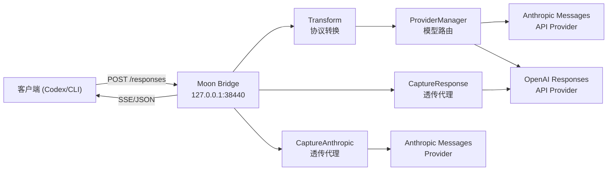
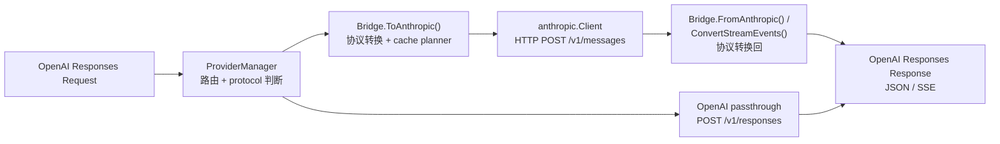
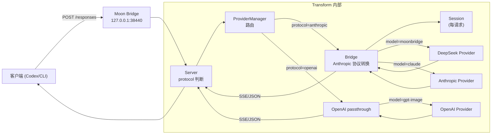

# Moon Bridge 架构

Moon Bridge 是一个 Go 中间层服务，提供 OpenAI Responses API 兼容接口。Transform 模式下，它会按模型别名路由请求：Anthropic 协议 Provider 走 OpenAI Responses ↔ Anthropic Messages 转换，OpenAI 协议 Provider 走 Responses 直通代理。

## 架构总览



## 运行模式

Moon Bridge 支持三种运行模式，由 `config.yml` 中的 `mode` 字段控制：

### Transform（默认）

协议转换和模型路由模式。接收 OpenAI Responses 请求后，先按 `provider.models` 解析模型别名和 Provider：

- `protocol: "anthropic"`：转为 Anthropic Messages 请求发送至上游，再将响应转换回 OpenAI Responses 格式。
- `protocol: "openai"`：保留 OpenAI Responses 格式，直接透传到上游 Responses 端点，并把请求里的模型别名改写为上游真实模型名。

数据流：



### CaptureResponse

透明代理模式。请求按 OpenAI Responses 协议原样转发至上游 OpenAI-compatible Provider，不做协议转换。用于抓取 Codex 原生 Responses 请求作为协议对齐基准。

### CaptureAnthropic

透明代理模式。请求按 Anthropic Messages 协议原样转发至上游 Provider。用于抓取 Claude Code 或其他 Anthropic 客户端的真实请求。

## 模块分层

### cmd/moonbridge

项目唯一入口。解析命令行标志（`-config`, `-addr`, `-mode` 等），通过 `app.RunServer` 启动对应模式的服务。

```bash
# Transform 模式（默认）
./moonbridge

# CaptureResponse 模式
./moonbridge -mode CaptureResponse

# 打印配置的监听地址（供脚本使用）
./moonbridge -print-addr

# 打印 Codex 兼容的 config.toml
./moonbridge -print-codex-config moonbridge -codex-base-url http://127.0.0.1:38440
```

### internal/config

集中管理 YAML 配置。

- 读取 `config.yml`（或 `MOONBRIDGE_CONFIG` 环境变量指定路径）。
- 使用 `yaml.v3` `KnownFields(true)` 严格解析，防止字段拼写错误。
- 校验 mode、多 Provider 必填字段（`provider.providers.*.base_url` / `api_key` / `protocol`）、模型路由和缓存参数。
- 提供 `ModelFor()` 将客户端模型别名映射为上游真实模型名，并读取 `provider.web_search.support` 控制搜索工具是否自动探测、强制启用、禁用或 server-side injected。
- 全局 `provider.web_search.support` 作为回退默认值；推荐在 `provider.providers.<key>.web_search.support` 中按 provider 单独配置。
- 新增 `WebSearchForProvider()` / `WebSearchForModel()` 按 provider key 或模型别名解析 web search 配置（优先取 per-provider 值，未设置时回退全局值）。
- 新增 `WebSearchMaxUsesForProvider()` / `WebSearchTavilyKeyForProvider()` / `WebSearchFirecrawlKeyForProvider()` / `WebSearchMaxRoundsForProvider()` 等方法，按 provider 解析 injected 模式所需的 API key 和限制参数。

### internal/app

应用组装层。根据 mode 创建 ProviderManager、Bridge、trace tracer、HTTP handler、session 统计器，启动 HTTP server。

Transform 模式下，如果 `provider.web_search.support: auto`，启动时会用默认模型发送一次流式轻量 `web_search_20250305` 工具声明探测；只有探测证明可用才注入，否则进程内保守禁用 Codex `web_search` 工具注入。

Transform 模式下，`resolvePerProviderWebSearch()` 遍历所有已配置的 Provider，按 per-provider 配置（优先）或全局配置（回退）决定每个 Provider 的 web search 支持状态：

- 非 Anthropic 协议 Provider 自动禁用 web search。
- `disabled`：直接禁用。
- `enabled`：强制启用。
- `injected`：启用服务端 Tavily/Firecrawl 工具循环模式。
- `auto`：按 Provider 独立探测，使用该 Provider 的第一个上游模型发送轻量 `web_search_20250305` 工具声明探测，不再只探测 default provider。

解析结果通过 `ProviderManager.SetResolvedWebSearch()` 存储，供后续请求处理时查询。`injected` 模式不再在 `app.go` 中全局包装 default client，而是由 server 层在请求时按 provider 动态包装。

### internal/provider

多 Provider 路由层。

- `ProviderManager` 管理多个上游 Provider 的 HTTP client。
- `provider.models.<alias>.provider` 决定模型别名发往哪个 Provider。
- `provider.providers.<key>.protocol` 决定该 Provider 走 Anthropic 转换还是 OpenAI Responses 直通。
- 每个 Provider 拥有独立连接池，默认每主机 4 个 idle 连接、90 秒空闲超时。
- `ProviderManager` 新增 `resolvedWS` 字段（`map[string]string`）存储每个 Provider 的解析后 web search 状态。
- 新增 `SetResolvedWebSearch()` / `ResolvedWebSearch()` 按 provider key 存取解析结果；`ResolvedWebSearchForModel()` 按模型别名查询对应 provider 的 web search 状态。
- 新增 `FirstUpstreamModelForKey()` 返回某个 provider key 下第一个路由到该 provider 的上游模型名，用于 auto 模式探测。

### internal/server

HTTP 服务器层。提供 `/v1/responses` 和 `/responses` 两个 POST 端点。

- 解析请求体为 `openai.ResponsesRequest`。
- 根据模型别名判断 Provider protocol。
- OpenAI protocol：改写上游模型名，直接代理到上游 `/v1/responses`，并从上游 `usage` 中累计 session 统计。
- Anthropic protocol：调用 `Bridge.ToAnthropic()` 转换并拿到 cache 计划。
- 新增 `AppConfig` 字段存储完整配置，用于按 provider key 解析 web search 参数。
- `resolveProvider()` 现在会调用 `maybeWrapInjectedSearch()`，根据该 provider 的 resolved web search mode 动态包装 injected search orchestrator，而非启动时全局包装。
- 新增 `resolveRequestOptions()` 按 provider key 构建 per-request `bridge.RequestOptions`，包含该 provider 的 `WebSearchMode`、`WebSearchMaxUses`、`FirecrawlAPIKey` 等字段。
- 非流式：调用 Provider `CreateMessage()` → `Bridge.FromAnthropicWithPlanAndContext()` 转换回 → JSON 响应。
- 流式：调用 Provider `StreamMessage()` → 收集所有 SSE 事件 → `Bridge.ConvertStreamEventsWithContext()` 批量转换 → 写入 SSE 流。
- Anthropic 转换路径的请求/响应经 trace 系统记录；OpenAI protocol 直通路径保留上游响应和 usage 日志，错误场景会写 trace。
- 成功请求输出可读 Usage 行，模型名使用实际发往上游的模型名，Billing 使用 session 累计费用。
- 错误处理分两层：
  - Bridge 层返回的 `RequestError` 直接转为 OpenAI 错误格式。
  - Anthropic Provider 错误通过 `ProviderError.OpenAIStatus()` 映射为等价 HTTP 状态码。

### internal/bridge

协议转换核心模块。

- **`ToAnthropic()`**：将 OpenAI Responses Request 转为 Anthropic MessageRequest。处理 input、tools、tool_choice、历史消息合并、namespace 展平、web_search 工具桥接。
- `ToAnthropic()` 新增 `opts ...RequestOptions` 可变参数，接收 per-request 的 web search 配置。
- 新增 `RequestOptions` 结构体，包含 `WebSearchMode`、`WebSearchMaxUses`、`FirecrawlAPIKey` 等字段，由 server 层按 provider key 构建。
- `convertTools()` 根据 per-request `RequestOptions.WebSearchMode` 而非全局 config 决定 web search 行为。
- **`FromAnthropicWithPlanAndContext()`**：将 Anthropic MessageResponse 转为 OpenAI Response。处理 tool_use → function_call / local_shell_call / custom_tool_call 映射，namespace function 回拆，web_search_call 过滤，usage 归一化。
- **`ConvertStreamEventsWithContext()`**：逐事件将 Anthropic SSE 流转为 OpenAI 流。管理 content_block 级别的 state 跟踪，处理 text / tool_use / server_tool_use 三种 block 类型的流式拼接。
- **`ConversionContext`**：缓存本轮请求的 custom tool 集合、grammar kind 和 namespace function 映射，确保 custom grammar 工具不被当成普通 function_call 处理，并能在响应侧拼回 raw custom input / 拆回 Codex namespace。
- **`convertInput()`**：历史消息转换的关键逻辑：连续 `function_call` / `local_shell_call` 归并为同一个 assistant `tool_use` 消息，连续工具输出归并为随后的 user `tool_result` 消息。
- **`ErrorResponse()`**：统一错误映射，区分请求校验错误和 Provider 错误。

### internal/cache

Prompt cache 管理和规划。

- **`MemoryRegistry`**：内存级别的缓存状态记录（warming / warm / expired / missed），按 `localKey`（基于 Provider、模型、TTL、工具/系统/消息 hash 的复合键）索引。
- **`Planner`**：根据 PlannerConfig（mode / TTL / breakpoints / min tokens）和 Registry 状态，生成 `CacheCreationPlan`。plan 包含顶层 `cache_control` 策略和块级断点位置；长会话下会把剩余断点预算分配到更早的消息前缀，而不是只缓存最后一条消息。
- **`injectCacheControl()`** 在 `Bridge` 中：按 plan 向 Anthropic 请求的 tools、system 和选中的 message prefix block 注入 `cache_control`。
- 缓存 TTL 支持 `5m`（ephemeral）和 `1h`。`automatic` 模式发送顶层 `cache_control`，`explicit` 模式发送块级断点，`hybrid` 模式两者兼有。

### internal/anthropic

Anthropic Messages API HTTP 客户端。

- `CreateMessage()`：POST `/v1/messages`，返回完整响应。
- `StreamMessage()`：POST `/v1/messages`（`stream: true`），返回 SSE 读取器。
- `sseStream`：逐行解析 SSE 格式，分隔 event 和 data，反序列化为 `StreamEvent`。
- `ProviderError`：封装上游 HTTP 错误，包含 status code、error type、request ID。

### internal/openai

OpenAI Responses 协议 DTO 定义。包含 `ResponsesRequest`、`Response`、`OutputItem`、`Usage`、`InputTokensDetails`（`cached_tokens` 无 `omitempty`，始终序列化）、以及全部 SSE 事件类型。

### internal/extensions

Provider 扩展模块。当前包含：

- `deepseek_v4`：处理 reasoning_content 剥离、reasoning_effort → thinking 映射、流式 thinking 跟踪等 DeepSeek 特有行为。
- `websearch` / `websearchinjected`：当 `provider.web_search.support: injected` 时，向模型注入 `tavily_search` / `firecrawl_fetch` 工具，并在服务端执行搜索循环。

其他 Provider 特有逻辑可直接在此目录下新增子包。

### internal/session

每请求状态容器。当前用于隔离 DeepSeek V4 thinking state，避免并发请求之间互相污染。Session 在 HTTP 请求开始时创建，请求结束后由 GC 回收。

### internal/stats

session 级 token 和费用统计。

- `SessionStats.Record()` 累计请求数、输入/输出、cache creation、cache read 和费用。
- `provider.models.<alias>.pricing` 提供按 M tokens 计价的 input/output/cache write/cache read 价格。
- 每请求 INFO 行展示当前请求 usage 和 session 累计 Billing。
- 服务退出时输出 `Summary：Session Cache Hit Rate(AVG): ... Billing: ... CNY` 以及详细拆解。

### internal/proxy

透明代理实现。`ResponseServer` 和 `AnthropicServer` 分别对应两种协议的透明代理。均继承自共同的 `common.go` 中的 `copyHeaders`、`copyStreaming`、`upstreamURL` 等基础工具函数。

### internal/trace

请求/响应转储系统。

- 目录结构：
  - Transform 模式：`trace/Transform/{session_id}/Response/{n}.json` 和 `trace/Transform/{session_id}/Anthropic/{n}.json`
  - Capture 模式：`trace/Capture/{Response|Anthropic}/{session_id}/{n}.json`
- 序列化时自动脱敏 `Authorization`、`x-api-key` 等敏感 Header（替换为 `[REDACTED]`）。
- 文件权限 600，目录权限 700。

## 关键设计决策

### 协议兼容性

- 支持 `/responses` 和 `/v1/responses` 两个路径，兼容 Codex CLI 的不同路由约定。
- `usage.input_tokens_details.cached_tokens` 即使为 0 也序列化输出，避免 Codex 压缩上下文时解析失败。
- `local_shell_call` 使用独立 JSON schema 和 output item 类型，不走普通 `function_call` 路径。
- `web_search_call` 流式中 `input_json_delta` 不产生 `function_call_arguments.delta`，而是并入 `action` 字段；当 Provider 探测不支持 web search 时，不向上游注入搜索工具；`injected` 模式则改为服务端 Tavily/Firecrawl 工具循环。
- web search 支持现在按 provider 独立判断：每个 provider 根据其 resolved web search mode（`enabled` / `disabled` / `injected` / auto 探测结果）决定是否向上游注入搜索工具或启用服务端 Tavily/Firecrawl 工具循环。
- 空 `text_delta` / 空 `output_text` 不再生成 message 输出或 Anthropic `text` block，避免下一轮工具历史里出现 `{"type":"text"}` 这种缺少 `text` 字段的非法内容。

### 消息顺序

Anthropic Messages API 要求轮次内 `tool_use` block 不能跨消息分割。Bridge 在历史转换时将连续的工具调用归并到同一 `assistant` 消息，相应结果归并到连续的 `user` 消息，确保兼容。

### Cache 策略

- `explicit_cache_breakpoints` + `automatic_prompt_cache: false` 是推荐的保守配置，匹配 Claude Code 抓包行为。
- `automatic` + `explicit` 同时开启时为 `hybrid` 模式；实际命中率依赖 Provider、模型和请求形态，需以 `cache_read_input_tokens` 为准。

### 工具映射

- `namespace` 工具在 Anthropic 侧展平为 `mcp__deepwiki__ask_question` 样式；响应回 Codex 时按本轮 `ConversionContext` 拆回 `namespace:"mcp__deepwiki__"` + `name:"ask_question"`，历史回放和 `tool_choice` 再拼回 Anthropic 扁平名。
- DeepWiki 确认 Codex 内置 grammar/freeform 工具主要是 `apply_patch` 和 Code Mode `exec`；Moon Bridge 依赖 `format.definition` 识别 grammar kind，而不是只看工具名。
- `apply_patch` 在 Anthropic 侧拆成 `apply_patch_add_file`、`apply_patch_delete_file`、`apply_patch_update_file`、`apply_patch_replace_file`、`apply_patch_batch` 工具集合，响应时统一回映射为 Codex `apply_patch` custom call 并拼回 `*** Begin Patch` / `*** End Patch` raw grammar；proxy 描述只讲结构化 JSON 操作，不再带 Codex 原始 `FREEFORM` / grammar 提示。`replace_file` 和 `update_file + content` 会转成 `Delete File` + `Add File` 的整文件替换，避免生成空 Update hunk。
- Code Mode `exec` 在 Anthropic 侧暴露为 `{source: string}` schema，响应时把 `source` 原样拼回 Codex custom tool input；proxy 描述同样不暴露原始 grammar。
- DeepWiki / MCP 的具体使用约束属于代理提示词层，由 `AGENTS.md` 管理；Transform 层只负责按协议展平和转发工具定义，不改写 MCP 工具说明。

## 多 Provider & 会话隔离

当前版本支持多 Provider 架构和每请求会话隔离：

### Provider 路由

- **ProviderManager** (`internal/provider/`) 管理多个上游 Provider 客户端
- 配置中通过 `provider.providers` 定义多个 Provider（DeepSeek、OpenAI、Anthropic 等）
- `provider.models` 中的每个模型别名可指定 `provider` 键，决定请求发往哪个上游
- 每个 Provider 拥有独立的 `http.Client` 和连接池配置
- `Bridge.ProviderFor()` 不再硬编码返回 `"default"`，无显式映射时返回空字符串
- server 侧 `resolveProvider()` 使用三级 fallback 链：
  1. `ProviderManager.ClientFor(modelAlias)` — 按 model alias 精确路由
  2. `ClientForKey(providerKey)` — 按 Bridge.ProviderFor 返回的 key 路由
  3. 遍历任意可用 Provider — 最后兜底
- `handleOpenAIResponse()` 在 `Bridge.ProviderFor` 返回空时调用 `ProviderKeyForModel()` 二次解析路由 key
- `app.resolveDefaultClient()` 安全处理无 default provider 场景：defaultKey 为空或 client 不可用时返回 nil，下游 web search probing 和 fallback Provider 包装条件性跳过
- 启动时 `resolvePerProviderWebSearch()` 遍历所有 provider，按 per-provider 配置或全局回退解析 web search 状态，结果存入 `ProviderManager.resolvedWS`
- 请求时 `resolveProvider()` 调用 `maybeWrapInjectedSearch()` 根据该 provider 的 resolved web search mode 动态包装 injected search orchestrator，而非启动时全局包装
- `resolveRequestOptions()` 按 provider key 构建 per-request `bridge.RequestOptions`，传递给 `Bridge.ToAnthropic()` 以决定该请求的 web search 行为

### 会话隔离

- **Session** (`internal/session/`) 为每请求创建独立状态容器
- DeepSeek V4 thinking 缓存从全局 `Bridge` 移至 Session 内
- 并发请求的 thinking 状态互不干扰
- Session 在请求创建时分配，请求完成后由 GC 回收

### 连接池

- 每个 Provider 使用独立的 `http.Transport`，配置 `MaxIdleConnsPerHost` / `IdleConnTimeout`
- 默认值：4 连接/主机，90 秒空闲超时
- SSE 流式请求天然保活



### OpenAI 协议直通

定义 Provider 时可指定 `protocol` 字段：

- `"anthropic"`（默认）：请求经 Bridge 协议转换后以 Anthropic Messages 格式发送到上游
- `"openai"`：请求**不经过 Bridge 转换**，以原始 OpenAI Responses 格式直接透传代理到上游

OpenAI 协议 Provider 会创建一个与上游的直连 HTTP 代理，支持流式（SSE）和非流式响应。适用于：
- 直接对接 OpenAI API（图像生成、TTS、嵌入等不需要 Anthropic 转换的请求）
- 对接其他 OpenAI-compatible 提供商

### 费用统计

每请求日志（非流式/流式，包括 OpenAI protocol passthrough 在响应包含 usage 时）都会输出一行可读 Usage：

```text
{UpstreamModel} Usage: {input_m} M Input, {output_m} M Output, Session Cache Hit Rate: {rate}%, Billing: {total} CNY
```

其中 `{UpstreamModel}` 是实际转发到上游的模型名，`Billing` 是 session 累计费用。每请求 `Input` 展示采用 OpenAI 语义：`input_tokens + cache_read_input_tokens`，不把 `cache_creation_input_tokens` 额外计入展示值；cache creation 仍按 `cache_write_price` 计费，并保留在详细汇总里。

服务器关闭时输出完整会话费用汇总，包含按模型分组的费用明细和缓存命中率：

```text
Summary：Session Cache Hit Rate(AVG): 25.0%, Billing: 3.04 CNY
```

费用依据 `provider.models.<alias>.pricing` 配置计算，价格单位是人民币元 / M tokens。

配置示例：

```yaml
provider:
  models:
    gpt-5.4:
      pricing:
        input_price: 1          # ¥1 / M tokens
        output_price: 2         # ¥2 / M tokens
        cache_write_price: 0
        cache_read_price: 0.2   # ¥0.2 / M tokens
```
