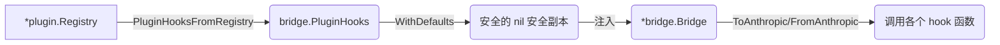

# Extension 系统

Moon Bridge 的 Extension 系统基于能力接口（capability interfaces）的插件架构。插件通过实现 `Plugin` 基础接口和零个或多个能力接口来扩展桥接能力。

## 核心接口

### Plugin（基础接口）

所有插件必须实现 `plugin.Plugin` 接口：

```go
// internal/extension/plugin/plugin.go
type Plugin interface {
    Name() string                    // 唯一标识符（如 "deepseek_v4"）
    Init(ctx PluginContext) error    // 初始化，接收配置
    Shutdown() error                 // 关闭，释放资源
    EnabledForModel(modelAlias string) bool  // 是否对指定模型启用
}

type PluginContext struct {
    Config    any           // 已按 extension config spec 解码的 typed config
    AppConfig config.Config  // 全局配置（只读）
    Logger    *slog.Logger   // 带插件名的 logger
}

type ConfigSpecProvider interface {
    ConfigSpecs() []config.ExtensionConfigSpec
}

type BasePlugin struct{}  // 提供所有方法的 no-op 默认实现
```

### 能力接口（Capability Interfaces）

插件可按需实现以下能力接口。`plugin.Registry` 在注册时通过类型断言自动检测。

#### 请求管道（Request Pipeline）

| 接口 | 方法 | 作用时机 |
|------|------|----------|
| `InputPreprocessor` | `PreprocessInput(ctx, raw) RawMessage` | 输入 JSON 反序列化之前 |
| `MessageRewriter` | `RewriteMessages(ctx, messages) []Message` | 输入消息列表转换后 |
| `RequestMutator` | `MutateRequest(ctx, req)` | Anthropic 请求构建后、发送前 |
| `ToolInjector` | `InjectTools(ctx) []Tool` | 工具转换时注入额外工具 |

#### 提供商管道（Provider Pipeline）

| 接口 | 方法 | 作用时机 |
|------|------|----------|
| `ProviderWrapper` | `WrapProvider(ctx, provider) any` | 包装上游 Provider 客户端 |

#### 响应管道（Response Pipeline）

| 接口 | 方法 | 作用时机 |
|------|------|----------|
| `ContentFilter` | `FilterContent(ctx, block) (skip, extraOutput)` | 逐块处理响应内容 |
| `ResponsePostProcessor` | `PostProcessResponse(ctx, resp)` | 最终 OpenAI Response 构建后 |
| `ContentRememberer` | `RememberContent(ctx, content)` | 完整响应内容可用时 |

#### 流式管道（Streaming Pipeline）

| 接口 | 方法 | 作用时机 |
|------|------|----------|
| `StreamInterceptor` | `NewStreamState() any` | 创建流状态 |
| | `OnStreamEvent(ctx, event) (consumed, emit)` | 每个流事件 |
| | `OnStreamComplete(ctx, outputText)` | 流完成 |

#### 历史重建（History Reconstruction）

| 接口 | 方法 | 作用时机 |
|------|------|----------|
| `ThinkingPrepender` | `PrependThinkingForToolUse(messages, toolCallID, summary, state) []Message` | 工具调用前补充 thinking 块 |
| | `PrependThinkingForAssistant(blocks, summary, state) []ContentBlock` | 助手消息前补充 thinking 块 |
| `ReasoningExtractor` | `ExtractThinkingBlock(ctx, summary) (ContentBlock, bool)` | 从 reasoning summary 恢复 thinking 块 |

#### 错误处理

| 接口 | 方法 | 作用时机 |
|------|------|----------|
| `ErrorTransformer` | `TransformError(ctx, msg) string` | 上游错误消息转换 |

#### 会话状态

| 接口 | 方法 | 作用时机 |
|------|------|----------|
| `SessionStateProvider` | `NewSessionState() any` | 新会话创建时 |

#### 日志

| 接口 | 方法 | 作用时机 |
|------|------|----------|
| `LogConsumer` | `ConsumeLog(ctx, entries) []LogEntry` | 日志刷新时 |

## 注册表（Registry）

`plugin.Registry` 管理所有注册的插件，按能力类型分类存储。

```go
// internal/extension/plugin/registry.go
type Registry struct {
    plugins            []Plugin
    inputPreprocessors []InputPreprocessor
    requestMutators    []RequestMutator
    toolInjectors      []ToolInjector
    // ... 其他能力列表
}
```

### 注册流程

```go
// 1. 创建注册表
registry := plugin.NewRegistry(logger.L())

// 2. 注册插件（自动检测能力和配置规格）
registry.Register(deepseekv4.NewPlugin())

// 3. 初始化（传递 AppConfig 和 typed extension 配置）
registry.InitAll(&cfg)  // cfg.ExtensionConfig("deepseek_v4", "") → *deepseekv4.Config

// 4. 在应用关闭时清理
defer registry.ShutdownAll()
```

## 与 Bridge 的集成

`bridge.PluginHooks` 是一个函数结构体，解耦 bridge 包对 plugin 包的依赖：

```go
// internal/protocol/bridge/hooks.go
type PluginHooks struct {
    PreprocessInput       func(model string, raw json.RawMessage) json.RawMessage
    RewriteMessages       func(ctx HookContext, messages []anthropic.Message) []anthropic.Message
    InjectTools           func(ctx HookContext) []anthropic.Tool
    MutateRequest         func(ctx HookContext, req *anthropic.MessageRequest)
    RememberResponseContent func(model string, content []anthropic.ContentBlock, sessionData map[string]any)
    OnResponseContent     func(model string, block anthropic.ContentBlock) (skip bool, reasoningText string)
    PostProcessResponse   func(ctx HookContext, resp *openai.Response)
    TransformError        func(model string, msg string) string
    NewSessionData        func() map[string]any
    PrependThinkingToAssistant func(...) []anthropic.ContentBlock
    PrependThinkingToMessages  func(...) []anthropic.Message
    NewStreamStates       func(model string) map[string]any
    ResetStreamBlock      func(...)
    OnStreamBlockStart    func(...) bool
    OnStreamBlockDelta    func(...) bool
    OnStreamBlockStop     func(...) (consumed bool, reasoningText string)
    OnStreamToolCall      func(...)
    OnStreamComplete      func(...)
}
```

适配过程在 `pluginhooks` 包中完成：



## 配置方式

在 `config.yml` 的 `extensions` 节配置扩展参数。扩展自己的参数放在 `config:`，启用状态放在对应 scope 的 `enabled` 中：

```yaml
extensions:
  deepseek_v4:
    config:
      reinforce_instructions: true
      reinforce_prompt: "[System Reminder]: ...\n[User]:"

provider:
  providers:
    deepseek:
      models:
        deepseek-v4-pro:
          extensions:
            deepseek_v4:
              enabled: true
```

插件通过 `ConfigSpecProvider` 声明自己的配置结构：

```go
func (p *DSPlugin) ConfigSpecs() []config.ExtensionConfigSpec {
    return []config.ExtensionConfigSpec{{
        Name: "deepseek_v4",
        Scopes: []config.ExtensionScope{
            config.ExtensionScopeGlobal,
            config.ExtensionScopeProvider,
            config.ExtensionScopeModel,
            config.ExtensionScopeRoute,
        },
        Factory: func() any { return &Config{} },
    }}
}

func (p *DSPlugin) Init(ctx plugin.PluginContext) error {
    p.cfg = plugin.Config[Config](ctx)
    p.appCfg = ctx.AppConfig
    return nil
}

func (p *DSPlugin) EnabledForModel(model string) bool {
    return p.appCfg.ExtensionEnabled("deepseek_v4", model)
}
```

## 实现 Demo

### 最小化插件

```go
package demo

import (
    "moonbridge/internal/extension/plugin"
)

const PluginName = "demo"

type DemoConfig struct {
    Prefix string `json:"prefix,omitempty" yaml:"prefix"`
}

type DemoPlugin struct {
    plugin.BasePlugin
    prefix string
}

func NewPlugin() *DemoPlugin {
    return &DemoPlugin{}
}

func (p *DemoPlugin) Name() string { return PluginName }

func (p *DemoPlugin) Init(ctx plugin.PluginContext) error {
    cfg := plugin.Config[DemoConfig](ctx)
    if cfg != nil {
        p.prefix = cfg.Prefix
    }
    ctx.Logger.Info("demo plugin initialized", "prefix", p.prefix)
    return nil
}

func (p *DemoPlugin) EnabledForModel(model string) bool {
    // 对所有模型启用
    return true
}
```

### 带能力的插件

```go
// 追加自定义系统消息的插件
type SystemInjectionPlugin struct {
    plugin.BasePlugin
    systemMessage string
}

func (p *SystemInjectionPlugin) Name() string { return "system_inject" }

// --- ToolInjector (在请求中注入额外工具) ---
func (p *SystemInjectionPlugin) InjectTools(ctx *plugin.RequestContext) []anthropic.Tool {
    return []anthropic.Tool{{
        Name:        "get_current_time",
        Description: "Get the current system time",
        InputSchema: map[string]any{
            "type": "object",
            "properties": map[string]any{
                "timezone": map[string]any{"type": "string"},
            },
        },
    }}
}

// --- RequestMutator (修改发送给上游的请求) ---
func (p *SystemInjectionPlugin) MutateRequest(ctx *plugin.RequestContext, req *anthropic.MessageRequest) {
    req.System = append(req.System, anthropic.ContentBlock{
        Type: "text",
        Text: p.systemMessage,
    })
}

// --- ContentFilter (过滤响应内容) ---
func (p *SystemInjectionPlugin) FilterContent(ctx *plugin.RequestContext, block anthropic.ContentBlock) (bool, []openai.OutputItem) {
    if block.Type == "tool_use" && block.Name == "get_current_time" {
        // 服务端自行执行，返回结果
        extra := []openai.OutputItem{{
            Type:   "function_call_output",
            CallID: block.ID,
            Output: `{"time": "2026-04-28T12:00:00Z"}`,
        }}
        return true, extra
    }
    return false, nil
}

// 编译期接口断言
var (
    _ plugin.Plugin          = (*SystemInjectionPlugin)(nil)
    _ plugin.ToolInjector    = (*SystemInjectionPlugin)(nil)
    _ plugin.RequestMutator  = (*SystemInjectionPlugin)(nil)
    _ plugin.ContentFilter   = (*SystemInjectionPlugin)(nil)
)
```

### 注册 Demo 插件

```go
// 在 service/app/app.go 的 runTransform() 中：
registry.Register(demo.NewPlugin())
registry.Register(&SystemInjectionPlugin{})
if err := registry.InitAll(&cfg); err != nil {
    return fmt.Errorf("init plugins: %w", err)
}
defer registry.ShutdownAll()
```

## HookContext 详解

`bridge.HookContext` 贯穿所有插件调用，提供请求上下文：

```go
type HookContext struct {
    ModelAlias  string              // 模型别名（如 "moonbridge"）
    SessionData map[string]any      // 跨请求会话数据，按插件名索引
    Reasoning   map[string]any      // OpenAI reasoning 配置
    WebSearch   HookWebSearchInfo   // Web Search 配置（Mode / MaxUses / FirecrawlKey）
}
```

Session data 的隔离由 `session.Session` 保证——不同的会话（由 `Session_id` 或 `X-Codex-Window-Id` 头标识）使用不同的 `ExtensionData` 映射。
